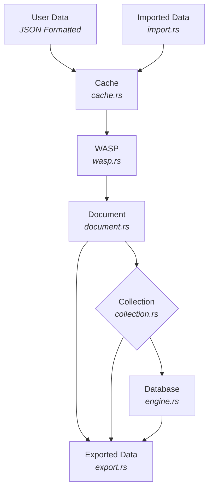

# Nexus Lite - Project Development Roadmap

Nexus-Lite is an embedded **NoSQL database engine**, inspired by the best features of **MongoDB** (document collections) and **Redis** (in-memory performance, TTL, and LRU caching). The goal is to provide a **lightweight, embeddable, efficient, and flexible** database engine similar to SQLite but for NoSQL workloads.

---

## AGILE Project Roadmap

We’ll follow an **iterative AGILE approach** where each sprint adds working, testable functionality.  
Future features will always build on stable, well-tested foundations.

**Notes:**

- Design with concurrency in mind using `RwLock` from the start.
- Design with async in mind using `tokio` for both network and file-based async I/O.
- Design modules with error handling and logging using the `thiserror`, `log`, and `log4rs` crates.

### Sprint 1 - Core In-Memory Engine

- [x] Developer Documentation (Project_Development.md).
- [x] Implement error handling and logging using the crates `log` and `log4rs`.
- [x] Implement `Document` module (`document.rs`)
  - Create, find, update, delete BSON-like documents.
  - When creating a new document, the document will be assigned a document UUID v4.
  - Documents will also store metadata that describes the document details.
  - There should be two types of documents: persistent and temporary.
  - Temporary document metadata will support an optional Time-To-Live (TTL) and are stored in a hidden collection and loaded into memory on startup.
  - Allow metadata (timestamps, versioning, or user tags) be optional extension points from the start. Future upgrades benefit from this flexibility.
- [x] Implement `Collection` module (`collection.rs`)
  - Manage sets of documents inside named collections.
  - Collections will maintain an index of document UUIDs.
  - Collections will also store vector index of each document.
  - A "hidden" collection also needs to be created called `_tempDocuments` that will contain ephemeral documents.
- [x] Implement `Engine` module (`engine.rs`)
  - Manage multiple collections.
  - Create, save, delete database files.
- [x] Implement Rust API calls to database engine (`lib.rs`)
  - Add builder patterns (e.g. `Document::builder().field(...).build()`), to make creation more fluent.
- [ ] Ensure `RwLock` use is properly scoped.
  - Benchmark read-heavy scenarios to spot deadlocks early.
- [x] Add unit & integration testing framework (`tests/` + `common/test_logger.rs`).
- [x] Generate Rust documentation (RustDoc) using `cargo doc`.
- [x] Perform tests and then troubleshoot and fix any issues.
  - Due to how logging works, we do not use a `mod_logging.rs` file since we cannot have 2 loggers be initialized at the same time.
  - Add tests around invalid UUIDs, empty collections, or creating duplicate collection names to prove resilience.
- [x] Update Developer Documentation (Project_Development.md).

### Sprint 2 - Cache Layer (Redis-inspired)

- [x] Implement a **Hybrid TTL & LRU eviction policy**.
  - [x] TTL has highest priority. Always evict entries whose TTL has expired before considering LRU-based eviction.
  - [x] Fallback to LRU sampling when no TTL-expired entries are found; sample size configurable via `max_samples`.
  - [x] Implemented approximation of LRU using tail sampling; tunable `max_samples` available.
  - [x] Strategy aligns with keeping freshness over recency.
  - [x] Separated sections in `cache.rs` combining TTL + LRU.
- [x] Include comprehensive metrics as part of the cache layer:
  - [x] Hit/miss counters
  - [x] Eviction counts by type (TTL vs LRU)
  - [x] Memory/latency stats
- [x] Give the system flexibility to tune eviction behavior:
  - [x] Runtime adjustable `max_samples`, `batch_size`, `capacity`, and eviction mode
  - [x] Per-collection overrides via `Engine::create_collection_with_config`
- [x] Implement a guard against thundering evictions:
  - [x] Eviction batching
  - [x] Eviction lock to prevent concurrent eviction cycles
- [x] Handle TTL expiration proactively
  - [x] Background sweeper with configurable interval
  - [x] Lazy expiration on access increments miss count
- [x] Allow configuration of TTL and LRU parameters at runtime.
  - [x] Eviction modes: `ttl-first`, `lru-only`, `ttl-only`, `hybrid`
  - [x] Per-collection override supported
- [x] Implement the **cache using the hybrid eviction policy** for documents.
  - [x] Lazy eviction + periodic low-priority background purging
  - [x] Purge trigger exposed for deterministic tests
- [x] Implement logic to load all ephemeral documents from the internal `_tempDocuments` collection into the cache on database startup.
- [x] Perform tests and then troubleshoot and fix any issues.
- [x] Perform unit tests for each scenario:
  - [x] TTL expiration evicts before LRU
  - [x] LRU sampling when no TTLs are expired
  - [x] Batching and lock under concurrent pressure
  - [x] Lazy-expiration counts as miss
- [x] Update Developer Documentation (Project_Development.md).

### Sprint 3 - Persistence

- [x] Implement a hybrid crash-consistent storage engine (`Write-Ahead Shadow-Paging` or `WASP`; `wasp.rs`) and make it the default backend.
- [x] Pluggable storage engine: swap between WAL and WASP for benchmarking.
- [x] Add a benchmark test comparing WAL vs WASP, saving results to `benchmarks/`.
- [x] Phase 0: Design and requirements for WASP:
  - [x] Define requirements/goals (ACID level, workload patterns, durability guarantees, concurrency model).
  - [x] Decide page size (e.g., 8–16 KB) and segment size targets (e.g., 64–256 MB).
    - Page size should be 8-16 KB that aligns to the device. Delta pages for tiny updates.
    - Segment size targets should be 64-256 MB and leveled compaction fan-out 8-10.
  - [x] Choose on-disk format endianness, alignment, and checksums.
  - [x] Implement block allocator / free space map abstraction.
  - [x] Build manifest structure (root pointer + active segments + WAL metadata).
- [x] Phase 1: Minimal CoW Engine
  - [x] Implement page format (headers, checksums, version ids).
  - [x] Implement copy-on-write B-tree or LSM-like node tree for data storage.
  - [x] Add manifest write and atomic pointer flip (double-buffered).
  - [x] Implement crash-safe read path (scan manifest → open latest root).
  - [x] Unit test: basic insert/read/delete, durability after crash simulation.
- [x] Phase 2: Tiny WAL Layer
  - [x] Design WAL record format: {txn id, page ids, checksums, new root id, epoch}.
  - [x] Add WAL append + fdatasync logic.
  - [x] Implement group commit batching.
  - [x] Integrate WAL into commit path (before manifest flip).
  - [x] Recovery logic: read manifest, replay WAL to finish incomplete CoW updates.
  - [x] Stress test: power-fail injection during updates. (basic test via append/recover)
- [x] Phase 3: Immutable Segment Store
  - [x] Define segment file format (sorted key ranges, fence keys, bloom filters).
  - [x] Add logic to seal cold data into segments (CoW → segment flush).
  - [x] Implement read path that merges CoW + segments.
  - [x] Add bloom filter acceleration for segment lookups.
  - [x] Unit test: query workload across mixed hot/cold data.
- [x] Phase 4: Compaction & Space Reclaim
  - [x] Implement background compaction engine (leveled or tiered).
  - [x] Add token-bucket throttling to cap IO usage. (future)
  - [x] Integrate with free space map to recycle old pages/segments.
  - [x] Add epoch-based GC for safe cleanup of obsolete data.
  - [x] Stress test: long-running workload without space leaks.
- [x] Phase 5: Concurrency & MVCC
  - [x] Add epoch-based snapshot tracking for readers.
  - [x] Implement MVCC visibility rules (readers see stable snapshot, writers advance epochs).
  - [x] Optimize for multiple concurrent readers, single writer (common embedded pattern).
  - [x] Benchmark concurrent read-write workloads. (future)
- [x] Phase 6: Durability & Integrity Hardening
  - [x] Add end-to-end checksums (pages, WAL, manifest, segments).
  - [x] Add torn-write protection (length-prefixed records, double-write slots).
  - [x] Optionally support copy-verify (read-after-write) for non-power-safe devices. (future)
  - [x] Build consistency checker tool (fsck-style).
  - [x] Fuzz test: corrupt WAL/pages/manifest, ensure graceful recovery.
- [x] Phase 7: Performance & Productionization
  - [x] Implement block cache for hot pages/segments.
  - [x] Add prefetch/pipelining for sequential scans.
  - [x] Optimize manifest updates (batch multiple commits per flip).
  - [x] Add statistics & metrics (WAL usage, compaction debt, cache hit ratio).
  - [x] Benchmark against baseline DBs (SQLite WAL, LMDB, RocksDB).
- [x] Implement collection snapshots. (stub)
- [x] Store the database in a **single file** (like SQLite) with a separate file for the WASP engine (`{db_name}.wasp` file).
- [x] Implement a periodic, configurable **checkpointing process** to merge the WASP into the main database file.
- [x] Perform tests and then troubleshoot and fix any issues.
- [x] Update Developer Documentation (Project_Development.md).

### Sprint 4 - Import & Export Features

- [ ] Implment import features to import various data formats.
  - The importer should infer what data format is being imported.
  - Once inferred, it should import the data into the database properly formatted.
  - At a minimum, the importer should support CSV, JSON, BSON and Pandas DataFrame formats.
- [ ] Implement export features to export to various data formats.
- [ ] Perform tests and then troubleshoot and fix any issues.
- [ ] Update Developer Documentation (Project_Development.md).

### Sprint 5 - Querying & APIs

- [ ] Query engine (`find_documents_by_field`, operators `$gt`, `$lt`, `$in`, etc.).
- [ ] Update operators (`$set`, `$inc`, `$unset`).
- [ ] Create REST/gRPC API for external usage.
- [ ] Developer-friendly Rust API bindings.
- [ ] Deployment tooling (CLI & embedded support).
- [ ] Perform tests and then troubleshoot and fix any issues.
- [ ] Update Developer Documentation (Project_Development.md).

### Sprint 6 - Optimization, Extensions, Additional Features

- [ ] Indexing strategies.
- [ ] Transaction support.
- [ ] Implement Key/Pair based encryption and decryption using ECC-256 bit encryption.
- [ ] Implement signature verification using ECDSA.
- [ ] Perform tests and then troubleshoot and fix any issues.
- [ ] Update Developer Documentation (Project_Development.md).

---

## Future Enhancements and Optional Features

- Add support for PQC encryption/decryption and signature verification of the database.
  - Use `pqcrypto-mlkem` for key encapsulation (`ml-kem-512`, `ml-kem-768`, `ml-kem-1024`).
  - Use `pqcrypto-sphincsplus` for signature verification (`128`, `192`, `256`-bit hash functions).
  - Provide Cargo feature flags to toggle encryption support.
  - Encrypt snapshots, WAL, and per-collection files.
  - Sign persisted data to ensure integrity.
- Add support for full, multi-document ACID transactions.
- Add Vector Map Indexing for searching through collections and documents.
  - Use the `hnsw` crate for efficient approximate nearest neighbor search.
  - Implement indexing on document fields for faster queries.
  - Support for multi-dimensional vectors and various distance metrics.
- Future Enhancements to the WASP recovery engine.
  - Add secondary indexes.
  - Support multi-writer concurrency (fine-grained latching).
  - Add encryption at rest (per-page or per-segment keys).
  - Implement online backup/checkpointing.
  - Consider pluggable compression for segments.

---

## Database Architecture



---

## Project Structure

The following is the current project structure, subject to change:

```text
nexus_lite
├── src\
│   ├── api.rs
│   ├── cache.rs
│   ├── cli.rs
│   ├── collection.rs
│   ├── crypto.rs
│   ├── document.rs
│   ├── engine.rs
│   ├── errors.rs
│   ├── export.rs
│   ├── import.rs
│   ├── lib.rs
│   ├── logger.rs
│   ├── types.rs
│   ├── wal.rs
│   └── wasp.rs
├── tests\
│   ├── common\
│   │   └── test_logger.rs
│   ├── integration.rs
│   ├── mod_api.rs
│   ├── mod_cli.rs
│   ├── mod_collection.rs
│   ├── mod_crypto.rs
│   ├── mod_document.rs
│   ├── mod_engine.rs
│   ├── mod_errors.rs
│   ├── mod_export.rs
│   ├── mod_import.rs
│   ├── mod_lib.rs
│   ├── mod_logger.rs
│   ├── mod_types.rs
│   ├── mod_wal.rs
│   └── mod_wasp.rs
├── .gitignore
├── Cargo.lock
├── Cargo.toml
└── Project_Development.md
```

---

## Modules

### Document Module: document.rs

- Purpose: Represents BSON-like records.
- Features:
  - Document::new() --> create with UUID.
  - Document::update() --> update existing document.

### Collection Module: collection.rs

- Purpose: Group of documents.
- Features:
  - Collection::new() --> Create a new collection with name and uuid.
  - Collection::insert_document() --> Insert a document.
  - Collection::find_document() --> Find a document by ID.
  - Collection::update_document() --> Update a document.
  - Collection::delete_document() --> Delete a document.
  - Collection::list_document_ids() --> List all document IDs.
- Future Additions:
  - Create a vector map for searching.
  - Querying and indexing.

### Cache Module: cache.rs

### WAL Module: wal.rs

### Types Module: types.rs

### Errors Module: errors.rs

### Engine Module: engine.rs

### Logger Module: logger.rs

### Import Module: import.rs

### Export Module: export.rs

### API Module: api.rs

- Purpose: Provides a Rust API abstraction for embedding into apps.

### CLI Module: cli.rs

- Purpose: Provides CLI support for developers and database administration.

### Database Module: lib.rs

---

## Example Usage (Sprint 1)

```rust
use serde_json::json;
use nexus_lite::{Database, Document};

fn main() {
    let mut db = Database::new();

    // Create a collection
    db.create_collection("users");

    // Insert a document
    let user_doc = Document::new(json!({"username": "alice", "age": 30}));
    let users = db.get_collection_mut("users").unwrap();
    let doc_id = users.insert_document(user_doc);

    // Query document
    let found = users.find_document(&doc_id).unwrap();
    println!("Found: {:?}", found);

    // Update document
    let updated = Document::new(json!({"username": "alice", "age": 31}));
    users.update_document(&doc_id, updated);

    // Delete document
    users.delete_document(&doc_id);
}
```
