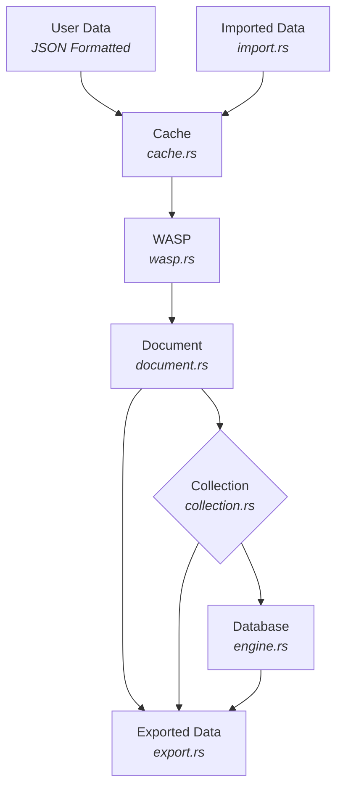

# NexusLite — Project Development

This document is for contributors and maintainers. It covers local setup, coding standards, build/test guidance, and module notes. For the project roadmap and sprint checklists, see Project_Roadmap.md.

## Linting & Coding Standards

```powershell
cargo clippy -q --all-targets --all-features -- -D warnings -W clippy::pedantic -W clippy::nursery --fix
```

- Common lint to avoid: needless reference of operands in comparisons (clippy::op-ref).
  - Prefer bytes[0..4] != SNAPSHOT_MAGIC over &bytes[0..4] != SNAPSHOT_MAGIC.
- CI denies warnings; use targeted #[allow(...)] only when justified and scoped.
- Concurrency: use parking_lot::RwLock, keep lock scopes minimal.
- Errors/logging: thiserror + log + log4rs.
- Avoid unwrap/expect in runtime paths; prefer ? and explicit handling.

## Local Build and Tests

- Build:

```bash
cargo build
```

- Run all tests:

```bash
cargo test
```

```bash
cargo test -- --nocapture
```

- Enable regex feature tests:

```bash
cargo test --features regex
```

```bash
cargo test --features regex -- --nocapture
```

- Clippy and formatting:

```bash
cargo clippy -q --all-targets --all-features -- -D warnings
cargo fmt --all
```

- Fuzz Testing:

```bash
cargo fuzz run <fuzz_target>
```

- Mutant Testing:

```bash
cargo mutant run
```

- Interactive/Mock Testing:

```bash
cargo test --test interactive
```

Notes

- Some tests are interactive and ignored by default; see README’s Interactive tests section.
- Logs are written next to DB files when using Database::open/new.

## CLI structure and usage (developer preview)

The `nexuslite` CLI follows a noun-verb structure with grouped subcommands. Flat aliases like `open-db`, `feature-list`, etc., have been removed during active development to keep the surface clean. Use the grouped forms only:

- Feature flags:
  - List: `nexuslite feature list`
  - Info: `nexuslite feature info <name>`
  - Enable/Disable: `nexuslite feature enable <name>` / `nexuslite feature disable <name>`
- Recovery:
  - Auto-recover getter/setter: `nexuslite recovery auto-recover` (get), or `nexuslite recovery auto-recover --enabled true|false` (set)
- Database:
  - New/Open/Close: `nexuslite db new [<path>]`, `nexuslite db open <path>`, `nexuslite db close <path>`
- Collections:
  - Create/Delete/List/Rename: `nexuslite collection create <name>`, `delete <name>`, `list`, `rename <old> <new>`
- Queries:
  - Find/Count/Update/Delete/One-ops: `nexuslite query find ...`, `count ...`, `update ...`, `delete ...`, `update-one ...`, `delete-one ...`

Other commands that remain single-level for now:

- Import/Export, Info, Doctor, Shell, Crypto (keygen/sign/verify/encrypt/decrypt), Telemetry setters, Encrypted checkpoint/restore, PBE encrypt/decrypt.

Examples:

```powershell
# Open a DB (prompts for creds if PBE-encrypted and interactive)
nexuslite db open .\my.db

# Enable recovery feature and set auto-recover
nexuslite feature enable recovery
nexuslite recovery auto-recover --enabled true

# Query (use default collection from config if omitted)
nexuslite query find --filter '{"a":1}'
```

## Module Overview (implementation notes)

### Document (src/document/)

- BSON-backed Document with UUID v4 DocumentId and metadata (created_at, updated_at, optional TTL).
- DocumentType::{Persistent, Ephemeral}; TTL applies to ephemeral.
- Helpers: set_ttl, get_ttl, is_expired, update.

### Collection (src/collection/)

- In-memory cache (TTL-first + LRU sampling), metrics, background sweeper.
- Append operations to storage for insert/update/delete.
- Hidden _tempDocuments collection for ephemeral docs.

### Recovery Engine (src/recovery/)

- Initializes _tempDocuments; preloads ephemeral docs from storage.
- Persists and reloads index metadata; see index module.
- High-level helpers: recovery::recover::{verify_manifests, repair_manifests, validate_resilience}.
- WASP internals re-exported under recovery::wasp::*.

### Query (src/query)

- Typed filters/operators; projection, multi-key sort, pagination.
- Updates: $set, $inc, $unset; FindOptions supports timeouts.
- Telemetry lives under query::telemetry and is re-exported at crate root.

### Import/Export (src/import/, src/export/)

- Streaming NDJSON/CSV/BSON with auto-detect and per-format options.
- Export supports filter, limit, and redaction of top-level fields.

### Crypto (src/crypto/)

- ECDSA P-256 sign/verify; ECDH(P-256)+AES-256-GCM file encryption; PBE helpers.
- PQC planned behind runtime flag crypto-pqc (stub only).

## Logging (utils/logger.rs)

NexusLite uses `log`/`log4rs`. For deterministic test logging, a developer-only pseudo-level (level 6) is available via the `dev6!` macro and a thread-local sink:

- Enable sink and capture:
  - let _g = nexuslite::utils::devlog::enable_thread_sink();
  - dev6!("debug {}", 42);
  - let msgs = nexuslite::utils::devlog::drain();
- These messages are also emitted under target `nexuslite::dev6` at TRACE. Configure `log4rs` to persist them if desired.

## Development Workflow

1. Create a feature branch off main.
2. Make focused commits; prefer small, tested changes.
3. Run tests locally (cargo test). For regex-related tests, enable the regex feature.
4. Update docs when public APIs change (README, module docs, this file if relevant).
5. Open a PR; CI runs lint, tests, fuzz smoke, and security checks.

## Troubleshooting

- Windows rename contention: exports/checkpoints use retries; ensure AV/indexers aren’t locking files.
- Snapshot decode errors: see README “Snapshot format and versioning”.
- PBE open: set NEXUSLITE_USERNAME and NEXUSLITE_PASSWORD in non-interactive environments.

## Security & Supply Chain

- Unsafe Rust is forbidden (#![forbid(unsafe_code)]).
- CI runs cargo audit and cargo deny with the repo’s deny.toml.
- Prefer environment variables for secrets; logs redact secret-like keys.

## Documenting Changes

- Keep README aligned with code: ensure examples compile against current public API.
- Keep this doc focused on contributor workflow; planning lives in Project_Roadmap.md.

---

## Testing and QA

This project has four test suites:

- Unit tests (automated):
- Integration tests (automated): lives under `tests/integration_tests/`
- Property tests (automated): lives under `tests/prop_tests/`
- Interactive tests (manual): lives under `tests/interactive/` and are ignored by default

Automated suites can be run directly with Cargo (no shell wrappers):

- Integration tests: `cargo test -q --test integration_tests`
- Property tests: `cargo test -q --test prop_tests`
- All (aggregator): `cargo test -q --test all`

Cargo aliases (for convenience):

- Unit tests (colocated in src via `#[cfg(test)]`): `cargo unit-tests`
- Integration tests: `cargo integration-tests`
- Property tests: `cargo prop-tests`

### Interactive tests (manual)

Interactive tests validate real TTY prompts for opening an encrypted database via the `nexuslite` binary. They are intentionally marked `#[ignore]` and will only run correctly in a real terminal (TTY). When executed in a non-TTY (e.g., CI or VS Code’s default test runner), these tests will detect the lack of a TTY and skip.

How to run from a separate terminal:

1. Open a real terminal window (PowerShell, Windows Terminal, cmd).
1. From the project root, run: `cargo test --test interactive -- --ignored --nocapture`
1. Follow the on-screen prompts. For the “correct credentials” test, use:

- Username: `admin`
- Password: `password`

1. The “incorrect credentials” test will ask you to enter random short credentials; it should fail as expected.

Notes

- The CLI prompts only when stdin is a TTY. Programmatic API paths are non-interactive and require credentials via environment when opening encrypted DBs.
- For programmatic/non-interactive opens (used in automated tests), set `NEXUSLITE_USERNAME` and `NEXUSLITE_PASSWORD` environment variables before invoking the relevant command or API.
- The interactive tests spawn the `nexuslite` binary with inherited stdio and will skip automatically if a TTY is not detected.

---

## Future Enhancements and Optional Features

- Add stricter redaction for secrets detection using the key matcher list and pattern-based value masking across outputs.
- Add support for PQC encryption/decryption and signature verification of the database.
  - Use `pqcrypto-mlkem` for key encapsulation (`ml-kem-512`, `ml-kem-768`, `ml-kem-1024`).
  - Use `pqcrypto-sphincsplus` for signature verification (`128`, `192`, `256`-bit hash functions).
  - Provide Cargo feature flags to toggle encryption support.
  - Encrypt snapshots, WAL, and per-collection files.
  - Sign persisted data to ensure integrity.
- Add support for full, multi-document ACID transactions.
- Add Vector Map Indexing for searching through collections and documents.
  - Use the `hnsw` crate for efficient approximate nearest neighbor search.
  - Implement indexing on document fields for faster queries.
  - Support for multi-dimensional vectors and various distance metrics.
- Future Enhancements to the WASP recovery engine.
  - Add secondary indexes.
  - Support multi-writer concurrency (fine-grained latching).
  - Add encryption at rest (per-page or per-segment keys).
  - Implement online backup/checkpointing.
  - Consider pluggable compression for segments.
- Dynamic Library layer using C-ABI externs.

---

## Recent changes

- Query projection semantics now apply to returned payloads: when `FindOptions.projection` is set, the cursor yields documents containing only the selected fields. Sorting is still applied prior to projection.
- Property tests updated to use per-test temporary directories (`tempfile::tempdir()`), avoiding Windows file-lock contention during concurrent runs.

## Database Architecture



---

## Project Structure

The following is the current project structure, subject to change:

```text
nexuslite
├── .cargo\
│   └── config.toml
├── .github\
│   ├── workflows\
│   │   └── code_tests.yml
│   ├── FUNDING.yml
│   └── dependabot.yml
├── benchmarks\
│   ├── results\
│   ├── benchmark_wasp.rs
│   └── wal.rs
├── fuzz\
│   ├── corpus\
│   │   ├── fuzz_csv_import\
│   │   │   └── valid.csv
│   │   ├── fuzz_filter_parser\
│   │   │   ├── invalid_empty.json
│   │   │   ├── valid_and.json
│   │   │   └── valid_eq.json
│   │   ├── fuzz_ndjson_import\
│   │   │   └── valid.jsonl
│   │   └── fuzz_update_parser\
│   │       ├── invalid_op.json
│   │       ├── valid_inc.json
│   │       └── valid_set.json
│   ├── fuzz_targets\
│   │   ├── fuzz_csv_import.rs
│   │   ├── fuzz_eval.rs
│   │   ├── fuzz_filter_parser.rs
│   │   ├── fuzz_ndjson_import.rs
│   │   └── fuzz_update_parser.rs
│   └── Cargo.toml
├── src\
│   ├── api\
│   │   ├── admin.rs
│   │   ├── collections.rs
│   │   ├── db.rs
│   │   └── mod.rs
│   ├── bin\
│   │   └── nexuslite.rs
│   ├── cache\
│   │   ├── config.rs
│   │   ├── core.rs
│   │   ├── metrics.rs
│   │   ├── mod.rs
│   │   ├── policy.rs
│   │   └── size.rs
│   ├── cli\
│   │   ├── command.rs
│   │   ├── mod.rs
│   │   ├── runner.rs
│   │   └── util.rs
│   ├── collection\
│   │   ├── core.rs
│   │   ├── index_admin.rs
│   │   ├── mod.rs
│   │   └── ops.rs
│   ├── crypto\
│   │   ├── file_encryption\
│   │   │   ├── ecc.rs
│   │   │   ├── kyber.rs
│   │   │   └── mod.rs
│   │   ├── hash_secrets\
│   │   │   ├── argon2.rs
│   │   │   ├── dilithium.rs
│   │   │   └── mod.rs
│   │   ├── signature_verification\
│   │   │   ├── ecdsa.rs
│   │   │   ├── mod.rs
│   │   │   └── sphincs.rs
│   │   └── mod.rs
│   ├── database\
│   │   ├── engine.rs
│   │   ├── index.rs
│   │   └── mod.rs
│   ├── document\
│   │   ├── core.rs
│   │   ├── mod.rs
│   │   └── types.rs
│   ├── export\
│   │   ├── mod.rs
│   │   ├── options.rs
│   │   ├── pipeline.rs
│   │   └── sinks.rs
│   ├── import\
│   │   ├── bson.rs
│   │   ├── csv.rs
│   │   ├── detect.rs
│   │   ├── mod.rs
│   │   ├── ndjson.rs
│   │   ├── options.rs
│   │   ├── pipeline.rs
│   │   └── util.rs
│   ├── query\
│   │   ├── cursor.rs
│   │   ├── eval.rs
│   │   ├── exec.rs
│   │   ├── mod.rs
│   │   ├── parse.rs
│   │   ├── telemetry.rs
│   │   └── types.rs
│   ├── recovery\
│   │   ├── wasp\
│   │   │   ├── cache.rs
│   │   │   ├── consistency.rs
│   │   │   ├── manifest.rs
│   │   │   ├── mod.rs
│   │   │   ├── page.rs
│   │   │   ├── segment.rs
│   │   │   ├── snapshot.rs
│   │   │   ├── tree.rs
│   │   │   ├── types.rs
│   │   │   ├── wal.rs
│   │   │   └── wasp_engine.rs
│   │   ├── mod.rs
│   │   └── recover.rs
│   ├── utils\
│   │   ├── errors.rs
│   │   ├── feature_flags.rs
│   │   ├── fsutil.rs
│   │   ├── logger.rs
│   │   ├── mod.rs
│   │   └── types.rs
│   └── lib.rs
├── tests\
│   ├── integration_tests\
│   │   ├── _support\
│   │   │   ├── common\
│   │   │   │   ├── mod.rs
│   │   │   │   └── test_logger.rs
│   │   │   └── mod.rs
│   │   ├── api\
│   │   │   ├── mod.rs
│   │   │   ├── mod_api.rs
│   │   │   ├── mod_api_create_doc.rs
│   │   │   ├── mod_api_crypto.rs
│   │   │   ├── mod_api_import_export.rs
│   │   │   ├── mod_api_info_features.rs
│   │   │   └── mod_api_negative.rs
│   │   ├── cache\
│   │   │   ├── mod.rs
│   │   │   └── mod_cache.rs
│   │   ├── cli\
│   │   │   ├── mod.rs
│   │   │   ├── mod_cli.rs
│   │   │   ├── mod_open.rs
│   │   │   ├── mod_shell.rs
│   │   │   └── mod_verify.rs
│   │   ├── collection\
│   │   │   ├── mod.rs
│   │   │   └── mod_collection.rs
│   │   ├── crypto\
│   │   │   ├── mod.rs
│   │   │   └── mod_crypto.rs
│   │   ├── database\
│   │   │   ├── mod.rs
│   │   │   ├── mod_engine.rs
│   │   │   ├── mod_index.rs
│   │   │   ├── mod_paths.rs
│   │   │   ├── mod_snapshot.rs
│   │   │   └── mod_snapshot_open.rs
│   │   ├── document\
│   │   │   ├── mod.rs
│   │   │   ├── mod_concurrency.rs
│   │   │   ├── mod_create_document.rs
│   │   │   ├── mod_document.rs
│   │   │   └── mod_ephemeral.rs
│   │   ├── export\
│   │   │   ├── mod.rs
│   │   │   └── mod_export.rs
│   │   ├── import\
│   │   │   ├── mod.rs
│   │   │   └── mod_import.rs
│   │   ├── query\
│   │   │   ├── mod.rs
│   │   │   ├── mod_query.rs
│   │   │   ├── mod_query_features.rs
│   │   │   ├── telemetry_edges_tests.rs
│   │   │   └── telemetry_tests.rs
│   │   ├── recovery\
│   │   │   ├── wasp\
│   │   │   │   ├── mod.rs
│   │   │   │   └── mod_wasp.rs
│   │   │   ├── mod.rs
│   │   │   └── mod_recovery_manager.rs
│   │   ├── utils\
│   │   │   ├── mod.rs
│   │   │   ├── mod_errors.rs
│   │   │   ├── mod_feature_flags.rs
│   │   │   ├── mod_minimal_async.rs
│   │   │   └── mod_types.rs
│   │   ├── mod.rs
│   │   └── mod_lib.rs
│   ├── interactive\
│   │   ├── mod.rs
│   │   ├── mod_correct_credentials.rs
│   │   └── mod_incorrect_credentials.rs
│   ├── prop_tests\
│   │   ├── crypto\
│   │   │   ├── mod.rs
│   │   │   ├── prop_hash.rs
│   │   │   └── prop_sign.rs
│   │   ├── import\
│   │   │   ├── mod.rs
│   │   │   └── prop_import.rs
│   │   ├── query\
│   │   │   ├── mod.rs
│   │   │   ├── prop_parse_compare.proptest-regressions
│   │   │   ├── prop_parse_compare.rs
│   │   │   ├── prop_query.rs
│   │   │   ├── prop_sort.rs
│   │   │   └── proptest-regressions
│   │   ├── utils\
│   │   │   ├── mod.rs
│   │   │   ├── prop_feature_flags.rs
│   │   │   └── prop_fsutil.rs
│   │   └── mod.rs
│   ├── all.rs
│   ├── integration_tests.rs
│   ├── interactive.rs
│   └── prop_tests.rs
├── .gitignore
├── Cargo.lock
├── Cargo.toml
├── Project_Development.md
├── Project_Roadmap.md
├── README.md
├── build.rs
├── deny.toml
├── log4rs.yaml
├── rust-toolchain.toml
└── rustfmt.toml
```

---

## Modules (alignment)

Below is a quick reference for the modules and their current responsibilities.

- api.rs: Embedding-friendly helpers for DB open/new/close, CRUD, import/export, info report, and crypto helpers (ECC, PBE, encrypted checkpoint/restore, DB encrypt/decrypt).
- cache.rs: In-memory hybrid TTL-first + LRU cache with sweeper and metrics.
- cli.rs: Programmatic CLI dispatcher used by the binary; houses commands for import/export/query, admin, crypto, PBE DB toggles, and a signature verify helper.
- collection.rs: Collection abstraction managing documents, indexes, and cache wiring.
- crypto.rs: ECC (P-256) keygen/sign/verify; ECDH+HKDF→AES-256-GCM file crypto; Argon2id secret hashing; PBE (Argon2id→AES-256-GCM). PQC stubs included.
- document.rs: BSON-backed Document with metadata (type, timestamps, TTL) and helpers.
- engine.rs: Orchestrates collections and the recovery engine (default WASP).
- errors.rs: thiserror-based `DbError` with IO/domain variants.
- export.rs: Streaming export (CSV/NDJSON/BSON) with redaction; Windows-safe atomic writes.
- import.rs: Streaming import (CSV/NDJSON/BSON) with auto-detect, sidecar errors, and TTL mapping.
- index.rs: Index descriptors, metadata persistence, versioning, and rebuild-on-mismatch.
- lib.rs: User-facing Database API and global engine/registry helpers.
- logger.rs: Scoped logger initialization next to DB with log4rs.
- query.rs: Typed filter/update engine with projection/sort/pagination; optional regex.
- types.rs: Core types (DocumentId, ops enums, metadata structures).
- wal.rs: Append-only WAL for benchmarking and historical engine.
- wasp.rs: Default recovery engine (Write-Ahead Shadow-Paging) with CoW tree, WAL integration, segments, and compaction.

---

## On-disk snapshot format & compatibility

We introduced a lightweight header in the `.db` snapshot format:

- Magic: `NXL1` (4 bytes)
- Version: `u32` (currently 1)
- Payload: bincode `DbSnapshot`

Readers accept both the wrapped and legacy (payload-only) encodings. If the on-disk version is greater than the current, decoding returns `io::ErrorKind::Unsupported`. This is intentionally non-fatal for `Database::open/new` (best-effort index rebuild scanning), but the lower-level decode helper surfaces the error for tools/tests.
Readers now require the header; legacy payload-only snapshots are not supported. If the on-disk version is greater than the current, decoding returns `io::ErrorKind::Unsupported` (no panic).

---

## PQC roadmap and alignment

- Goals: Add hybrid PQC support while maintaining ECC paths. Keep crypto optional via feature flags and minimize public surface changes.
- KEM: Integrate ML-KEM (Kyber) via `pqcrypto-mlkem` for hybrid key exchange alongside P-256 ECDH; derive AEAD keys via HKDF.
- Signatures: Integrate SPHINCS+ via `pqcrypto-sphincsplus` for artifact/database signatures next to ECDSA.
- Phasing: start with encrypted checkpoint hybrid, then optional at-rest hybrid for `.db`/`.wasp`, then PQC signatures for `.sig` files.
- Tests: add vectors, round-trip, and tamper tests under `crypto-pqc` feature; CI matrix includes ECC-only and hybrid.
- Policy: signature enforcement selectable (warn vs hard-fail) in CLI and config; defaults conservative.

---

## Modules

### Document Module: document/

- Purpose: BSON-backed document with metadata, IDs, and TTL for ephemeral records.
- Features:
  - UUID v4 `DocumentId` assigned on creation
  - `DocumentType` (Persistent or Ephemeral)
  - Metadata: created_at, updated_at, optional TTL
  - `set_ttl`, `get_ttl`, `is_expired` helpers
  - `update` updates data and bumps `updated_at`

### Collection Module: collection/

- Purpose: Manage documents with a TTL-first + LRU cache and durable storage append.
- Features:
  - `new` and `new_with_config` to construct with cache capacity or config
  - `insert_document` writes to cache and appends Operation::Insert to storage
  - `find_document` reads from cache by ID
  - `update_document` upserts in cache and appends Operation::Update
  - `delete_document` evicts from cache and appends Operation::Delete
  - `get_all_documents` returns a snapshot Vec&lt;Document&gt; (clones; not streaming)
  - `cache_metrics` exposes cache metrics snapshot
  - Thread-safe via parking_lot::RwLock on storage

### Cache Module: cache/

- Purpose: In-memory cache with TTL-first plus LRU eviction to keep hot data fast.
- Features:
  - TTL expiration takes priority; lazy expiration on access
  - LRU sampling with configurable max_samples when no TTLs are expired
  - Eviction batching and guard to prevent thundering evictions
  - Background sweeper with configurable interval
  - Per-collection cache configuration and runtime tuning
  - Metrics: hits/misses, eviction counts, memory/latency stats

### Recovery Module: recovery/

- Purpose: Recovery engine using Write-Ahead Shadow-Paging (WASP).
- Features:
  - Copy-on-write page tree with checksums
  - Double-buffered manifest with atomic pointer flip
  - Tiny WAL integration for commit ordering
  - Immutable segment store with bloom filters
  - Background compaction and space reclaim (GC)
  - Snapshot/MVCC-friendly read path

### Types Module: utils/types.rs

- Purpose: Shared core types for IDs, operations, and metadata.
- Features:
  - Strongly-typed DocumentId (UUID v4)
  - Operation enums for insert/update/delete
  - Reusable structs/enums for cache and storage coordination

### Errors Module: utils/errors.rs

- Purpose: Centralized error definitions with rich context.
- Features:
  - thiserror-based DbError for ergonomic error handling
  - Variants for IO, serialization, and domain errors (e.g., NoSuchCollection)
  - Consistent messages surfaced across modules and CLI

### Database Module: database/

- Purpose: Orchestrates collections and persistence backends.
- Features:
  - Create/get/delete collections; list collection names; rename collections
  - Hidden `_tempDocuments` collection for ephemeral docs
  - On startup, loads ephemeral docs into cache when applicable
  - Thread-safe via parking_lot::RwLock

### Logger Module: utils/logger.rs

- Purpose: Initialize structured logging for the system.
- Features:
  - log/log4rs setup via `logger::init()`
  - Configurable levels and appenders through `log4rs.yaml`

### Import Module: import/

- Purpose: Streaming data ingestion for CSV, NDJSON (JSON Lines), and BSON.
- Features:
  - Auto-detect format with explicit override
  - Per-format options: CSV (delimiter, headers, type inference), JSON (array_mode)
  - skip_errors with sidecar `.errors.jsonl` capturing failures
  - TTL mapping via `ttl_field` for ephemeral documents; persistent toggle
  - Progress logging and basic batching controls

### Export Module: export/

- Purpose: Streaming export of collections to CSV, NDJSON, or BSON.
- Features:
  - CSV with optional headers and custom delimiter
  - NDJSON line-by-line output for large files
  - BSON length-prefixed streaming writer
  - Writes to temp file then atomically replaces destination (Windows-safe)
  - Returns ExportReport with written counts

### API Module: api/

- Purpose: Provides a Rust API abstraction for embedding into apps.
- Features:
  - Convenience helpers around core engine operations
  - Query helpers: find/count, update/delete (many + one)
  - Import/Export helpers
  - DB/Collection management (FFI-friendly): open DB, create/list/delete/rename collections
  - Stable surface for embedding while internals evolve

### CLI Module: cli/

- Purpose: Provides CLI support for developers and database administration.
- Features:
  - Import/Export commands
  - Collection admin: create/delete/list/rename
  - Query commands: find/count/update/delete (+ update_one/delete_one)
  - Programmatic entrypoint `cli::run(engine, cmd)` returning reports

### Wrapper Module: lib.rs

- Purpose: User-facing database wrapper around Engine with ergonomic helpers.
- Features:
  - `Database::new(name_or_path: Option<&str>)` creates `.db` (defaulting to `.db` extension) and `.wasp` if missing
  - `Database::open(name_or_path: &str)` opens existing `.db`, creating `.wasp` if missing; errors `Database Not Found` otherwise
  - `Database::close(name_or_path: Option<&str>)` unregisters/"closes" an open DB handle
  - Collection management: create/get/delete, list names
  - Document helpers: insert/update/delete
  - `nexuslite::init()` to initialize logging

---
