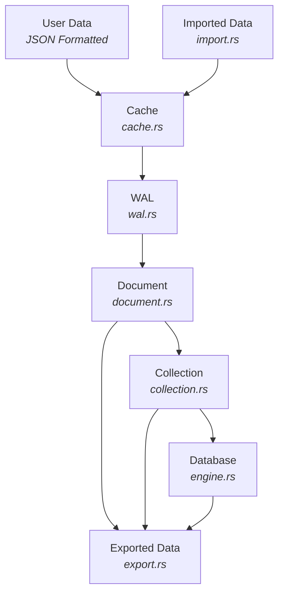

# Nexus Lite - Project Development Roadmap

Nexus-Lite is an embedded **NoSQL database engine**, inspired by the best features of **MongoDB** (document collections) and **Redis** (in-memory performance, TTL, and LRU caching). The goal is to provide a **lightweight, embeddable, efficient, and flexible** database engine similar to SQLite but for NoSQL workloads.

---

## AGILE Project Roadmap

We’ll follow an **iterative AGILE approach** where each sprint adds working, testable functionality.  
Future features will always build on stable, well-tested foundations.

**Notes:**

- Design with concurrency in mind using `RwLock` from the start as well as handling and logging errors.
- Design with async in mind using `tokio` for both network and file-based async I/O.

### Sprint 1 - Core In-Memory Engine

- [ ] Implement error handling and logging.
- [x] Implement `Document` module (`document.rs`)
  - Create, find, update, delete BSON-like documents.
  - When creating a new document, the document will be assigned a document UUID.
  - Documents will also store metadata that describes the document details.
- [x] Implement `Collection` module (`collection.rs`)
  - Manage sets of documents inside named collections.
  - Collections will maintain an index of document UUIDs.
  - Collections will also store vector index of each document.
- [x] Implement `Database` module (`engine.rs`)
  - Manage multiple collections.
  - Create, save, delete database files.
- [ ] Implement Rust calls to database engine (`lib.rs`)
- [x] Add unit & integration testing framework (`tests/` + `common/test_logger.rs`).
- [x] Developer Documentation (Project_Development.md).
- [ ] Generate Rust documentation (RustDoc) using `cargo doc`.
- [ ] Perform tests and then troubleshoot and fix any issues.

### Sprint 2 - Cache Layer (Redis-inspired)

- [ ] Implement a **Hybrid TTL & LRU eviction policy** for memory efficiency.
- [ ] Add in-memory **Hybrid eviction policy** for cache.
- [ ] Implement the **cache using the hybrid evicition policy** for documents.
- [ ] Cache → WAL → storage persistence pipeline.
- [ ] Perform tests and then troubleshoot and fix any issues.

### Sprint 3 - Persistence

- [ ] Implement **WAL (Write Ahead Log)** to persist operations using a write-through approach.
- [ ] Implement collection snapshots.
- [ ] Store collections in **segmented files per collection** using a **heap file + index** approach.
- [ ] Add stress/failure tests to the testing framework to test power loss simulations, cache eviction correctness, etc.

### Sprint 4 - Import & Export Features

- [ ] Implment import features to import various data formats.
  - The importer should infer what data format is being imported.
  - Once inferred, it should import the data into the database properly formatted.
- [ ] Implement export features to export to various data formats.
- [ ] Perform tests and then troubleshoot and fix any issues.

### Sprint 5 - Querying & APIs

- [ ] Query engine (`find_documents_by_field`, operators `$gt`, `$lt`, `$in`, etc.).
- [ ] Update operators (`$set`, `$inc`, `$unset`).
- [ ] Create REST/gRPC API for external usage.
- [ ] Developer-friendly Rust API bindings.
- [ ] Perform tests and then troubleshoot and fix any issues.

### Sprint 6 - Optimization, Extensions, Additional Features

- [ ] Indexing strategies.
- [ ] Transaction support.
- [ ] Deployment tooling (CLI & embedded support).
- [ ] Implement Key/Pair based encryption and decryption using ECC-256 bit encryption.
- [ ] Implement signature verification using ECDSA.
- [ ] Perform tests and then troubleshoot and fix any issues.

---

## Database Architecture



---

## Project Structure

The following is the current project structure, subject to change:

```text
nexus_lite
├── src\
│   ├── api.rs
│   ├── cache.rs
│   ├── cli.rs
│   ├── collection.rs
│   ├── crypto.rs
│   ├── document.rs
│   ├── engine.rs
│   ├── errors.rs
│   ├── export.rs
│   ├── import.rs
│   ├── lib.rs
│   ├── logger.rs
│   ├── types.rs
│   └── wal.rs
├── test_framework\
│   ├── common\
│   │   └── test_logger.rs
│   ├── integration.rs
│   ├── mod_api.rs
│   ├── mod_cli.rs
│   ├── mod_collection.rs
│   ├── mod_crypto.rs
│   ├── mod_document.rs
│   ├── mod_engine.rs
│   ├── mod_errors.rs
│   ├── mod_export.rs
│   ├── mod_import.rs
│   ├── mod_lib.rs
│   ├── mod_logger.rs
│   ├── mod_types.rs
│   └── mod_wal.rs
├── .gitignore
├── Cargo.lock
├── Cargo.toml
└── Project_Development.md
```

---

## Modules

### Document Module: document.rs

- Purpose: Represents BSON-like records.
- Features:
  - Document::new() --> create with UUID.
  - Document::update() --> update existing document.

### Collection Module: collection.rs

- Purpose: Group of documents.
- Features:
  - Collection::new() --> Create a new collection with name and uuid.
  - Collection::insert_document() --> Insert a document.
  - Collection::find_document() --> Find a document by ID.
  - Collection::update_document() --> Update a document.
  - Collection::delete_document() --> Delete a document.
  - Collection::list_document_ids() --> List all document IDs.
- Future Additions:
  - Create a vector map for searching.
  - Querying and indexing.

### Cache Module: cache.rs

### WAL Module: wal.rs

### Types Module: types.rs

### Errors Module: errors.rs

### Engine Module: engine.rs

### Logger Module: logger.rs

### Import Module: import.rs

### Export Module: export.rs

### API Module: api.rs

- Purpose: Provides a Rust API abstraction for embedding into apps.

### CLI Module: cli.rs

- Purpose: Provides CLI support for developers.

### Database Module: lib.rs

---

## Example Usage (Sprint 1)

```rust
use serde_json::json;
use nexus_lite::{Database, Document};

fn main() {
    let mut db = Database::new();

    // Create a collection
    db.create_collection("users");

    // Insert a document
    let user_doc = Document::new(json!({"username": "alice", "age": 30}));
    let users = db.get_collection_mut("users").unwrap();
    let doc_id = users.insert_document(user_doc);

    // Query document
    let found = users.find_document(&doc_id).unwrap();
    println!("Found: {:?}", found);

    // Update document
    let updated = Document::new(json!({"username": "alice", "age": 31}));
    users.update_document(&doc_id, updated);

    // Delete document
    users.delete_document(&doc_id);
}
```

---

## Future Enhancements

- Add support for PQC encryption/decryption and signature verification of the database.
  - Use `pqcrypto-mlkem` for key encapsulation (`ml-kem-512`, `ml-kem-768`, `ml-kem-1024`).
  - Use `pqcrypto-sphincsplus` for signature verification (`128`, `192`, `256`-bit hash functions).
  - Provide Cargo feature flags to toggle encryption support.
  - Encrypt snapshots, WAL, and per-collection files.
  - Sign persisted data to ensure integrity.
- Add Vector Map Indexing for searching through collections and documents
