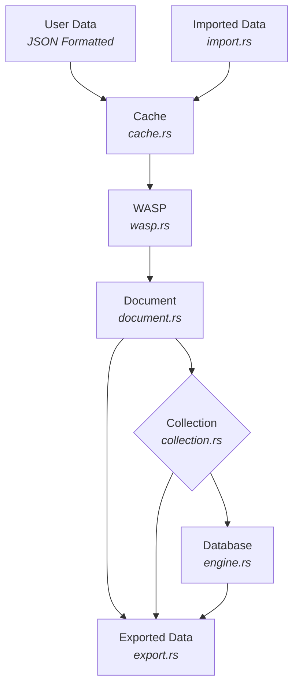

# NexusLite — Project Development

This document is for contributors and maintainers. It covers local setup, coding standards, build/test guidance, and module notes. For the project roadmap and sprint checklists, see Project_Roadmap.md.

## Linting & Coding Standards

```powershell
cargo clippy -q --all-targets --all-features -- -D warnings -W clippy::pedantic -W clippy::nursery --fix
```

- Common lint to avoid: needless reference of operands in comparisons (clippy::op-ref).
  - Prefer bytes[0..4] != SNAPSHOT_MAGIC over &bytes[0..4] != SNAPSHOT_MAGIC.
- CI denies warnings; use targeted #[allow(...)] only when justified and scoped.
- Concurrency: use parking_lot::RwLock, keep lock scopes minimal.
- Errors/logging: thiserror + log + log4rs.
- Avoid unwrap/expect in runtime paths; prefer ? and explicit handling.

## Local Build and Tests

- Build:

```powershell
cargo build
```

- Run all tests:

```powershell
cargo test -- --nocapture
```

- Enable regex feature tests:

```powershell
cargo test --features regex -- --nocapture
```

- Clippy and formatting:

```powershell
cargo clippy -q --all-targets --all-features -- -D warnings
cargo fmt --all
```

Notes

- Some tests are interactive and ignored by default; see README’s Interactive tests section.
- Logs are written next to DB files when using Database::open/new.

## Module Overview (implementation notes)

### Document (src/document)

- BSON-backed Document with UUID v4 DocumentId and metadata (created_at, updated_at, optional TTL).
- DocumentType::{Persistent, Ephemeral}; TTL applies to ephemeral.
- Helpers: set_ttl, get_ttl, is_expired, update.

### Collection (src/collection)

- In-memory cache (TTL-first + LRU sampling), metrics, background sweeper.
- Append operations to storage for insert/update/delete.
- Hidden _tempDocuments collection for ephemeral docs.

### Engine (src/database/engine.rs)

- WASP-backed Engine::with_wasp(path) is the default entrypoint for programmatic use.
- Initializes _tempDocuments; preloads ephemeral docs from storage.
- Persists and reloads index metadata; see index module.

### Query (src/query)

- Typed filters/operators; projection, multi-key sort, pagination.
- Updates: $set, $inc, $unset; FindOptions supports timeouts.
- Telemetry lives under query::telemetry and is re-exported at crate root.

### Import/Export (src/import, src/export)

- Streaming NDJSON/CSV/BSON with auto-detect and per-format options.
- Export supports filter, limit, and redaction of top-level fields.

### Recovery (src/recovery)

- High-level helpers: recovery::recover::{verify_manifests, repair_manifests, fuzz_corruption_check}.
- WASP internals re-exported under recovery::wasp::*.

### Crypto (src/crypto)

- ECDSA P-256 sign/verify; ECDH(P-256)+AES-256-GCM file encryption; PBE helpers.
- PQC planned behind runtime flag crypto-pqc (stub only).

## Development Workflow

1. Create a feature branch off main.
2. Make focused commits; prefer small, tested changes.
3. Run tests locally (cargo test). For regex-related tests, enable the regex feature.
4. Update docs when public APIs change (README, module docs, this file if relevant).
5. Open a PR; CI runs lint, tests, fuzz smoke, and security checks.

## Troubleshooting

- Windows rename contention: exports/checkpoints use retries; ensure AV/indexers aren’t locking files.
- Snapshot decode errors: see README “Snapshot format and versioning”.
- PBE open: set NEXUSLITE_USERNAME and NEXUSLITE_PASSWORD in non-interactive environments.

## Security & Supply Chain

- Unsafe Rust is forbidden (#![forbid(unsafe_code)]).
- CI runs cargo audit and cargo deny with the repo’s deny.toml.
- Prefer environment variables for secrets; logs redact secret-like keys.

## Documenting Changes

- Keep README aligned with code: ensure examples compile against current public API.
- Keep this doc focused on contributor workflow; planning lives in Project_Roadmap.md.

### Sprint 4 - Import & Export Features

- [x] Implement import features to import various data formats.
  - The importer should infer what data format is being imported.
  - Once inferred, it should import the data into the database properly formatted.
  - At a minimum, the importer should support CSV, JSON, BSON and Pandas DataFrame formats.
- [x] Implement export features to export to various data formats.
- [x] Perform tests and then troubleshoot and fix any issues.
- [x] Update Developer Documentation (Project_Development.md).

#### Detailed checklist for Sprint 4

- [x] Define import/export API contracts and options
  - [x] `import_from_reader`/`import_file` and `export_to_writer`/`export_file`
  - [x] Options include: `format (auto|ndjson|csv|bson)`, `collection`, `batch_size`, `persistent`, `ttl_field`, `skip_errors`
  - [x] Per-format options: CSV `{ delimiter, has_headers, type_infer? }`, JSON `{ array_mode?, pretty? }`

- [x] Prioritize streaming formats (memory-safe, large files)
  - [x] NDJSON (JSON Lines) import/export (stream via serde_json deserializer)
  - [x] CSV import/export (headers, delimiter support; stream via csv::Reader/Writer)
  - [x] BSON import/export (length-prefixed docs; stream read/write)

- [x] Format auto-detection with explicit override
  - [x] Use file extension as hint, then sniff first KB for: BOM/UTF-16, JSON tokens, CSV delimiter patterns, BSON length prefix
  - [x] Allow forcing the format via options when detection is ambiguous

- [x] Performance and memory controls
  - [x] Batch inserts with backpressure (configurable `batch_size`)
  - [x] Streamed IO with BufRead/Write; avoid loading entire datasets into memory

- [x] TTL and IDs mapping
  - [x] Optional `ttl_field` maps to ephemeral documents; otherwise persistent
  - [x] Accept optional `_id`; generate UUID if missing

- [x] Errors and reporting
  - [x] `skip_errors` mode: continue on row errors
  - [x] Produce sidecar `.errors.jsonl` with failed rows and reasons
  - [x] Return `ImportReport`/`ExportReport` with counts and timing

- [x] CLI integration (developer ergonomics)
  - [x] Programmatic CLI commands wired for import/export with tests

- [x] Windows-friendly file operations
  - [x] Export to a temp file and atomically replace destination (MoveFileExW with replace; fallback std::fs::rename + short retry)

- [x] Testing
  - [x] Unit tests for CSV/NDJSON/BSON parsers and type mapping
  - [x] Round-trip tests (import → export → compare)
  - [x] Large-file smoke tests (bounded memory)
  - [x] Windows path/encoding and atomic rename behavior

- [x] Documentation
  - [x] Update Project_Development.md with Sprint 4 completion
  - [x] README examples and pandas notes (NDJSON: `lines=True`)

### Sprint 5 - Query Engine, CLI & APIs

- [x] Core query engine with typed filters (no string-eval; injection-safe)
- [x] Public Rust APIs: find, count, update_many, delete_many, update_one, delete_one, cursor
- [x] Update operators: `$set`, `$inc`, `$unset` (validated and type-safe)
- [x] Projection, sort, pagination (limit/skip) and stable multi-key sort
- [x] CLI commands: find, count, update, delete (streaming NDJSON/CSV output)
  - Added single-document variants: update_one, delete_one
- [x] Baseline security: input validation, limits, lock-scoping
- [x] Tests: unit + integration
- [x] Documentation updates (Project_Development.md, README.md)

#### Detailed checklist for Sprint 5

- [x] Filter DSL and evaluation
  - [x] BSON/JSON filter structure with operators: `$eq`(implicit), `$gt`, `$gte`, `$lt`, `$lte`, `$in`, `$nin`, `$and`, `$or`, `$not`, `$exists`
  - [x] Dot-notation field paths for nested documents (e.g., `profile.name.first`)
  - [x] Type coercion for numerics (i32/i64/f64) with strict cross-type rules
  - [x] Clear distinction between missing and null; `$exists` semantics

- [x] Public APIs
  - [x] `find(&self, filter: &Filter, opts: &FindOptions) -> Cursor`
  - [x] `count(&self, filter: &Filter) -> usize`
  - [x] `update_many(&self, filter: &Filter, update: &UpdateDoc) -> UpdateReport`
  - [x] `delete_many(&self, filter: &Filter) -> DeleteReport`
  - [x] `Cursor`: iterator over IDs; resolves documents lazily; test-only `to_vec()`
  - [x] `FindOptions { projection, sort, limit, skip }` with `SortSpec { field, order }`

- [x] Update operators
  - [x] `$set`: assign/create nested field paths
  - [x] `$inc`: numeric add; error on non-numeric targets
  - [x] `$unset`: remove field if present
  - [x] `UpdateReport { matched, modified }` (modified only on value change)

- [x] Sort, projection, pagination
  - [x] Stable comparator with multi-key sort; deterministic total order
  - [x] Include-only projection by field paths
  - [x] Enforce reasonable `limit`/`skip` bounds

- [x] CLI (programmatic for now)
  - [x] `query find --collection C --filter JSON --project 'a,b' --sort '-age,+name' --limit N --skip M --output (ndjson|csv|bson)`
  - [x] `query count --collection C --filter JSON`
  - [x] `query update --collection C --filter JSON --update JSON`
  - [x] `query delete --collection C --filter JSON --confirm`
  - [x] Stream results as NDJSON by default; CSV optional (headers)

- [x] Security and safety
  - [x] Parse filter/update via serde into typed structs (no string interpolation)
  - [x] Enforce limits: max filter depth, max array length, max `$in` list size
  - [x] Optional `$regex` behind feature flag with length guard (<= 512 chars)
  - [x] Query timeout/cancellation hooks (best-effort deadline during scan)
  - [x] Avoid panics; return structured errors; property tests for evaluator
  - [x] Lock scoping: hold RwLocks minimally; snapshot IDs before iteration
  - [x] Memory: prefer iterators; avoid cloning full collections

- [x] Testing
  - [x] Unit: operators, nested paths, numeric coercion, exists/missing, projection
  - [x] Sort comparator correctness (multi-key, missing/null ordering)
  - [x] Update operators: set/inc/unset; matched vs modified
  - [x] Integration: import sample → queries → updates → exports
  - [x] CLI: parse/execute filters/updates; stream output fixtures

- [x] Documentation
  - [x] README: add “Query & Update” examples (Rust + CLI)
  - [x] Project_Development.md: finalize Sprint 5 spec and checklists

### Sprint 6 - Optimization, Security Hardening, Additional Features

- [x] Performance/indexing
  - [x] Initial indexing strategies (exact-match and range on popular fields)
  - [x] Implement an index manager abstraction to allow for future pluggable index types
  - [x] Basic index selection for single-field equality/range; fallback to full scan
  - [x] Track index statistics (size, hit/miss, build time) for observability
  - [x] Persist index metadata and rebuild if missing or inconsistent
  - [x] Implement indexing invalidation: Call out when indexes rebuild (insert/update/delete, collection renames) and persistence across restarts
  - [x] Index + WASP interaction: Define and implement an atomic "commit + index update" step; ensure index metadata/cardinality stays consistent across crashes
  - [x] Index build mode (acceptance): offline builds block writes to the target collection; reject writes during build with a clear error; tests cover build/rebuild safety (no data corruption)
  - [x] Minimal planner rule (acceptance): use a single-field index for simple equality/range predicates; otherwise full scan; tests assert planner chooses the index when available
  - [x] Index metadata versioning: bump on index format changes; auto-rebuild indexes on version mismatch at startup (document behavior)

- [x] API/CLI/UX
  - [x] Clap-based binary exposing Import/Export/Query commands and DB/collection admin (`src/bin/nexuslite.rs`)
  - [x] CLI config file loader with precedence (flags > env > config files > defaults)
    - [x] Config secrets hygiene: discourage storing secrets in config files; prefer environment variables; redact secret-like keys in logs and diagnostics
    - [x] Implement on-disk index metadata/versioning and rebuild UX
  - [x] `nexuslite info` command to print basic database stats (collections, cache metrics)
  - [x] `nexuslite doctor` command to check basic DB/WASP file access
    - [x] `nexuslite shell` for interactive query/collection management (REPL)
  - [x] Implement full API/FFI calls exposing Import/Export/Query commands, DB/collection admin, and an info to print engine/cache/index stats and other metrics that should be exposed (`api.rs`)
  - [x] Tests updated to cover CLI programmatic path; binary executes and compiles via cargo test

  Notes: As part of hardening, remaining uses of `.unwrap()`/`.expect()` in runtime paths were removed or isolated behind guaranteed-safe constructs. CLI now propagates errors instead of panicking.

- [x] Cryptography (optional features)
  - [x] ECC-256 encryption (key/Pair) and ECDSA signature verification
    - [x] ECC-256 based encryption for files (ECDH + AES-256-GCM) with header
  - [x] ECDSA signature verification for files
  - [x] Add API helper to hash secret fields in documents (argon2id)
  - [x] Add CLI option to redact or mask sensitive fields in exports; doctor masks secrets in config/env.
  - [x] PQC roadmap alignment (ml-kem, sphincs+) documented (see PQC section below)
  - [x] Add PQC code stub to the `crypto` module for future integration.
  - [x] Create tests for keygen/sign/verify, encrypt/decrypt, and hashing
  - [x] Update project documentation and README with CLI crypto commands and export redaction.

- [ ] Code security and supply-chain
  - [x] `cargo audit` + `cargo deny` in CI; fail on vulnerable/yanked deps
    - Configured GitHub Actions workflow at `.github/workflows/security.yml` and `deny.toml`.
  - [x] Clippy (pedantic + nursery) and rustfmt in CI; deny warnings
    - CI wired; repository remediation for warnings tracked separately.
  - [x] Forbid `unsafe` in crate (or gate behind feature if absolutely required)
    - Added `#![forbid(unsafe_code)]` at crate root.
  - [ ] Dependency pinning and minimal public surface review
  - [x] Implement a comprehensive security review process (e.g., threat modeling, attack surface analysis)
    - Added `SECURITY-THREAT-MODEL.md` initial draft.
  - [x] Add SECURITY.md with reporting and hygiene policy

- [x] Fuzzing and property tests
  - [x] `cargo fuzz` targets: filter parser, evaluator, update applier, CSV/NDJSON parsers
    - [x] filter parser
    - [x] evaluator
    - [x] update parser/applier
    - [x] CSV/NDJSON parsers
  - [x] Minimal seed corpora committed under `fuzz/corpus/*`
  - [x] Property tests
    - [x] Evaluator invariants (equality symmetry; integer order complement)
    - [x] CSV import inserts expected rows
    - [x] Multi-key sort stability
    - [x] Projection returns only selected fields; pagination bounds safety
  - [x] CI fuzz smoke workflow (`.github/workflows/fuzz-smoke.yml`)

- [x] Perform a complete review and update for both the `README.md` and `Project_Development.md` documentation.

- [x] Memory and concurrency safety
  - [x] Concurrency tests (basic loom model or stress tests) for lock ordering
    - Implemented a stress test (`tests/mod_concurrency.rs::concurrent_insert_read_update_stress`) that exercises parallel inserts/reads/updates and validates invariants; passed in the full suite.
  - [x] Cursor-based iteration in core paths to avoid large clones
    - Added a lazy, ID-based iteration path in `src/query.rs::find_docs` with `Collection::list_ids()` to avoid materializing full documents when projection/sort aren’t requested; validated by existing query tests.
  - [x] Optional sanitizer/miri runs in CI where feasible (nightly job)
  - [x] Ensure that the codebase is highly optimized and free of unnecessary allocations.
    - Streamed exports (NDJSON/CSV/BSON) iterate IDs and fetch on-demand, avoiding large Vec clones.
  - [x] Ensure that thread / CPU concurrency and asynchronous file I/O is being used properly to ensure optimal performance and reliability.
    - Added concurrent export test using spawn_blocking to isolate blocking I/O; file writes remain atomic with retries on Windows.

- [x] File I/O safety
  - [x] Use `tempfile::NamedTempFile` for atomic writes (avoid symlink races)
  - [x] Path normalization and validation; explicit permissions where applicable
    - New `fsutil::normalize_db_path` ensures `.db` extension and absolute path; used by `Database::new/open/close`.
    - New `fsutil::create_secure` creates files with restrictive permissions (0o600 on Unix; default ACLs on Windows).
  - [x] Retry/backoff strategy around Windows file locks, prefer short retries with jitter
  - [x] Expand file I/O hardening with explicit permissions on creation where applicable and targeted Windows retry/backoff around renames
    - Exports write to temp and atomically persist with Windows-friendly retries; WASP checkpoint writes directly on Windows to avoid rename sharing violations.
  - [x] Embed DB snapshot format version and magic; refuse newer versions and document the policy
    - `.db` snapshot now uses header: magic `NXL1` + `u32` version (current 1) + `DbSnapshot` payload; legacy raw `DbSnapshot` without a header is not supported in this initial build.
    - If a newer version is encountered, decoding returns `io::ErrorKind::Unsupported` (no panic). A new negative test asserts this behavior.
  - [x] Create tests as needed, run all tests, and fix any identified issues
    - Added `snapshot_newer_version_errors_gracefully` in `tests/mod_snapshot.rs` to validate error path for future-version snapshots.
  - [x] Update documentation as needed
    - README updated with snapshot format/versioning and compatibility policy.

- [x] Observability and abuse resistance
  - [x] Structured query logs with redaction for sensitive fields
    - Query path now emits structured slow-query lines (JSON) with fields: {ts, db, collection, filter_hash, duration_ms, limit, skip, slow} via `telemetry::log_query`.
  - [x] Rate limiting and quotas (per collection) via basic token-bucket; exposed in API/CLI
    - Added global and per-collection max result limit enforcement (default 10,000; overrides supported).
    - New CLI subcommands: telemetry-set-slow, telemetry-set-audit, telemetry-set-query-log, telemetry-set-max-global, telemetry-set-max-for, telemetry-rate-limit, telemetry-rate-remove.
    - Programmatic API: telemetry_set_db_name/query_log/audit_enabled, telemetry_set_max_results_global/_for, telemetry_configure_rate_limit/remove_rate_limit.
  - [x] Audit logging for all write operations (user, timestamp, changes) (Optional Feature)
    - Insert/Update/Delete emit audit records via `telemetry::log_audit`; off by default, toggle with `telemetry::set_audit_enabled(true)`.
  - [x] Query logging with user/session metadata (hook; user optional)
  - [x] Extra hardening (e.g., input validation, output encoding, regex timeouts)
  - [x] Query timeouts and max result size enforcement
  - [x] Add Prometheus/OpenMetrics export (optional feature) for cache/engine/query stats
    - Minimal text exposition via `telemetry::metrics_text()` for `nexus_*` counters.
  - [x] Add slow query log (configurable threshold)
    - Slow threshold via `NEXUS_SLOW_QUERY_MS` or API setter; logs include stable fields.
  - [x] Metrics naming stability documented (see README Modules/Logger + new Telemetry notes)
  - [x] Implemented a configurable logging system using log4rs plus per-DB scoped logs; added telemetry module for structured logs/metrics.
  - [x] Tests pass across the suite; added hooks are covered indirectly by existing query/write tests; no behavior regressions.
  - [x] Updated documentation as needed.

- [x] Feature flags
  - [x] Publish supported runtime flags: `crypto-ecc`, `crypto-pqc` (stub), `open-metrics`, `regex` (mirrors Cargo feature), `cli-bin`
  - [x] Document supported build combinations (MVP build matrix) and deny unknown features in CI
  - [x] Expose compiled features and runtime flags in `info` output; document in README

- [x] Code Security, Supply Chain, and Fuzzing and property tests (again)
  - [x] Perform code security checks and identify issues and problems.
  - [x] Perform supply chain checks and identify issues and problems.
  - [x] Perform fuzzing and property checks and identify issues and problems.
  - [x] Perform pedantic/nursery cleanup and identify issues and problems.
  - [x] Implement any required changes and update the README and Project Development documentation.
  
  Notes:
  - Clippy warnings are clean with `-D warnings` across all targets/features; targeted fixes applied in `build.rs`, `cli.rs`, `import.rs`, `telemetry.rs`, and tests.
  - Property tests and the full test suite pass locally; long-running CSV inference property test remains green.
  - Supply-chain checks are wired in CI (`cargo-audit`/`cargo-deny`); local runs are optional if the tools are installed.

- Run per-module tests and checks with `cargo fmt`, `cargo clippy`

---

## Testing and QA

This project has three test suites:

- Integration tests (automated): lives under `tests/integration_tests/`
- Property tests (automated): lives under `tests/prop_tests/`
- Interactive tests (manual): lives under `tests/interactive/` and are ignored by default

Automated suites can be run directly with Cargo (no shell wrappers):

- Integration tests: `cargo test -q --test integration_tests`
- Property tests: `cargo test -q --test prop_tests`
- All (aggregator): `cargo test -q --test all`

Cargo aliases (for convenience):

- Unit tests (colocated in src via `#[cfg(test)]`): `cargo unit-tests`
- Integration tests: `cargo integration-tests`
- Property tests: `cargo prop-tests`

### Interactive tests (manual)

Interactive tests validate real TTY prompts for opening an encrypted database via the `nexuslite` binary. They are intentionally marked `#[ignore]` and will only run correctly in a real terminal (TTY). When executed in a non-TTY (e.g., CI or VS Code’s default test runner), these tests will detect the lack of a TTY and skip.

How to run from a separate terminal:

1. Open a real terminal window (PowerShell, Windows Terminal, cmd).
1. From the project root, run: `cargo test --test interactive -- --ignored --nocapture`
1. Follow the on-screen prompts. For the “correct credentials” test, use:

- Username: `admin`
- Password: `password`

1. The “incorrect credentials” test will ask you to enter random short credentials; it should fail as expected.

Notes

- The CLI prompts only when stdin is a TTY. Programmatic API paths are non-interactive and require credentials via environment when opening encrypted DBs.
- For programmatic/non-interactive opens (used in automated tests), set `NEXUSLITE_USERNAME` and `NEXUSLITE_PASSWORD` environment variables before invoking the relevant command or API.
- The interactive tests spawn the `nexuslite` binary with inherited stdio and will skip automatically if a TTY is not detected.

- [ ] Unit tests
  - [ ] Colocate unit tests with source modules using `#[cfg(test)]` (e.g., `src/<module>/...` with `mod tests`)
  - [ ] Add a small test-only support module for temp dirs and file helpers
  - [ ] Cover core modules: utils, query (parse/eval/exec), api, crypto, import/export
  - [ ] Ensure unit tests run via `cargo unit-tests` (alias for `cargo test --lib`) and are included in CI

- [ ] Docs
  - [ ] Ensure that the codebase is properly documented as per Rust coding standards and best practices.
  - [ ] Add a "Deployment" section with guidelines for deploying the database.
  - [ ] Add a "Security Model" section to the documentation, outlining threat model, encryption and audit logging plans
  - [ ] Add a "Performance Tuning" section with cache, eviction, and index tuning tips.
  - [ ] Add a "Testing and QA" section with guidelines for writing tests and using CI tools.
  - [ ] Add a section for Transaction support exploration in the `Project_Development.md` documentation.
  - [ ] Add a section for compatibility policy and on-disk format versioning
  - [ ] Create API/CLI documentation using Rustdoc/mdBook and also make API/CLI documentation available as optional feature flag. Create an auto-generated CLI help/manpage. Metric names should also be inside of the documentation
  - [ ] Create a user guide (e.g., usage examples, tutorials).
  - [ ] Update Developer Documentation (Project_Development.md).
  - [ ] Update `README.md` documentation.

---

## Sprint 7: Benchmarks (Optional Feature) & MVP

- [ ] Create the necessary hooks within the database engine to support benchmarking. Tests should include, but not be limited to:
  - [ ] Query execution time tracking
  - [ ] Index usage statistics
  - [ ] Cache hit/miss ratios
  - [ ] WASP performance metrics
  - [ ] Document size and growth rate tracking
  - [ ] Query result size tracking
  - [ ] Cache eviction statistics
  - [ ] Document read/write latency tracking
  - [ ] Cache performance metrics
  - [ ] WASP recovery time tracking
  - [ ] Any other relevant metrics

- [ ] Perform sanity-check of feature flags, the `cli`, `api`, `bin/nexuslite` and `feature_flags` modules.
  - [ ] Document any changes to features and feature-flags

- [ ] Finalize repo for use as a Rust crate, including:
  - [ ] Add `nexuslite` as a dependency in `Cargo.toml`.
  - [ ] Ensure all public APIs are documented and tested.
  - [ ] Ensure all features are properly gated with feature flags.
  - [ ] Ensure the code and comments are well-structured and follows Rust conventions.
  - [ ] Ensure the code is well-tested and has good test coverage.
  - [ ] Ensure the code is well-documented and has good documentation.

  - [ ] Additional Testing/CI
    - [ ] Mutation testing with `cargo-mutants` (Deferred until later in development to prioritize iteration speed.). When re-enabling, run locally with `cargo mutants -v` and wire a CI workflow.

- [ ] Complete mutation and fuzz testing and document benchmarks.
- [ ] Fix any identified issues and problems and update README and Project Development documentation.

- [ ] Create a "packages" folder for the repo that include packages for, but not limited to:
  - [ ] Python
  - [ ] JavaScript / TypeScript
  - [ ] Go
  - [ ] C and C++
  - [ ] Rust
  - [ ] Binary executables for Windows, Linux, and macOS

- [ ] Verify .gitignore entries

---

## Future Enhancements and Optional Features

- Add stricter redaction for secrets detection using the key matcher list and pattern-based value masking across outputs.
- Add support for PQC encryption/decryption and signature verification of the database.
  - Use `pqcrypto-mlkem` for key encapsulation (`ml-kem-512`, `ml-kem-768`, `ml-kem-1024`).
  - Use `pqcrypto-sphincsplus` for signature verification (`128`, `192`, `256`-bit hash functions).
  - Provide Cargo feature flags to toggle encryption support.
  - Encrypt snapshots, WAL, and per-collection files.
  - Sign persisted data to ensure integrity.
- Add support for full, multi-document ACID transactions.
- Add Vector Map Indexing for searching through collections and documents.
  - Use the `hnsw` crate for efficient approximate nearest neighbor search.
  - Implement indexing on document fields for faster queries.
  - Support for multi-dimensional vectors and various distance metrics.
- Future Enhancements to the WASP recovery engine.
  - Add secondary indexes.
  - Support multi-writer concurrency (fine-grained latching).
  - Add encryption at rest (per-page or per-segment keys).
  - Implement online backup/checkpointing.
  - Consider pluggable compression for segments.
- Dynamic Library layer using C-ABI externs.

---

## Recent changes

- Query projection semantics now apply to returned payloads: when `FindOptions.projection` is set, the cursor yields documents containing only the selected fields. Sorting is still applied prior to projection.
- Property tests updated to use per-test temporary directories (`tempfile::tempdir()`), avoiding Windows file-lock contention during concurrent runs.

## Database Architecture



---

## Project Structure

The following is the current project structure, subject to change:

```text
nexus_lite
├── benchmarks\
│   ├── results\
│   ├── benchmark_wasp.rs
├── src\
│   ├── api.rs
│   ├── cache.rs
│   ├── cli.rs
│   ├── collection.rs
│   ├── crypto.rs
│   ├── document.rs
│   ├── engine.rs
│   ├── errors.rs
│   ├── export.rs
│   ├── import.rs
│   ├── index.rs
│   ├── lib.rs
│   ├── logger.rs
│   ├── query.rs
│   ├── types.rs
│   ├── wal.rs
│   └── wasp.rs
├── tests\
│   ├── common\
│   │   └── test_logger.rs
│   ├── integration.rs
│   ├── mod_api.rs
│   ├── mod_cache.rs
│   ├── mod_cli.rs
│   ├── mod_collection.rs
│   ├── mod_crypto.rs
│   ├── mod_document.rs
│   ├── mod_engine.rs
│   ├── mod_errors.rs
│   ├── mod_export.rs
│   ├── mod_import.rs
│   ├── mod_index.rs
│   ├── mod_lib.rs
│   ├── mod_query.rs
│   ├── mod_types.rs
│   ├── mod_wal.rs
│   └── mod_wasp.rs
├── .gitignore
├── Cargo.lock
├── Cargo.toml
├── README.md
└── Project_Development.md
```

---

## Modules (alignment)

Below is a quick reference for the modules and their current responsibilities.

- api.rs: Embedding-friendly helpers for DB open/new/close, CRUD, import/export, info report, and crypto helpers (ECC, PBE, encrypted checkpoint/restore, DB encrypt/decrypt).
- cache.rs: In-memory hybrid TTL-first + LRU cache with sweeper and metrics.
- cli.rs: Programmatic CLI dispatcher used by the binary; houses commands for import/export/query, admin, crypto, PBE DB toggles, and a signature verify helper.
- collection.rs: Collection abstraction managing documents, indexes, and cache wiring.
- crypto.rs: ECC (P-256) keygen/sign/verify; ECDH+HKDF→AES-256-GCM file crypto; Argon2id secret hashing; PBE (Argon2id→AES-256-GCM). PQC stubs included.
- document.rs: BSON-backed Document with metadata (type, timestamps, TTL) and helpers.
- engine.rs: Orchestrates collections and the storage backend (default WASP).
- errors.rs: thiserror-based `DbError` with IO/domain variants.
- export.rs: Streaming export (CSV/NDJSON/BSON) with redaction; Windows-safe atomic writes.
- import.rs: Streaming import (CSV/NDJSON/BSON) with auto-detect, sidecar errors, and TTL mapping.
- index.rs: Index descriptors, metadata persistence, versioning, and rebuild-on-mismatch.
- lib.rs: User-facing Database API and global engine/registry helpers.
- logger.rs: Scoped logger initialization next to DB with log4rs.
- query.rs: Typed filter/update engine with projection/sort/pagination; optional regex.
- types.rs: Core types (DocumentId, ops enums, metadata structures).
- wal.rs: Append-only WAL for benchmarking and historical engine.
- wasp.rs: Default storage engine (Write-Ahead Shadow-Paging) with CoW tree, WAL integration, segments, and compaction.

---

## On-disk snapshot format & compatibility

We introduced a lightweight header in the `.db` snapshot format:

- Magic: `NXL1` (4 bytes)
- Version: `u32` (currently 1)
- Payload: bincode `DbSnapshot`

Readers accept both the wrapped and legacy (payload-only) encodings. If the on-disk version is greater than the current, decoding returns `io::ErrorKind::Unsupported`. This is intentionally non-fatal for `Database::open/new` (best-effort index rebuild scanning), but the lower-level decode helper surfaces the error for tools/tests.
Readers now require the header; legacy payload-only snapshots are not supported. If the on-disk version is greater than the current, decoding returns `io::ErrorKind::Unsupported` (no panic).

---

## PQC roadmap and alignment

- Goals: Add hybrid PQC support while maintaining ECC paths. Keep crypto optional via feature flags and minimize public surface changes.
- KEM: Integrate ML-KEM (Kyber) via `pqcrypto-mlkem` for hybrid key exchange alongside P-256 ECDH; derive AEAD keys via HKDF.
- Signatures: Integrate SPHINCS+ via `pqcrypto-sphincsplus` for artifact/database signatures next to ECDSA.
- Phasing: start with encrypted checkpoint hybrid, then optional at-rest hybrid for `.db`/`.wasp`, then PQC signatures for `.sig` files.
- Tests: add vectors, round-trip, and tamper tests under `crypto-pqc` feature; CI matrix includes ECC-only and hybrid.
- Policy: signature enforcement selectable (warn vs hard-fail) in CLI and config; defaults conservative.

---

## Modules

### Document Module: document.rs

- Purpose: BSON-backed document with metadata, IDs, and TTL for ephemeral records.
- Features:
  - UUID v4 `DocumentId` assigned on creation
  - `DocumentType` (Persistent or Ephemeral)
  - Metadata: created_at, updated_at, optional TTL
  - `set_ttl`, `get_ttl`, `is_expired` helpers
  - `update` updates data and bumps `updated_at`

### Collection Module: collection.rs

- Purpose: Manage documents with a TTL-first + LRU cache and durable storage append.
- Features:
  - `new` and `new_with_config` to construct with cache capacity or config
  - `insert_document` writes to cache and appends Operation::Insert to storage
  - `find_document` reads from cache by ID
  - `update_document` upserts in cache and appends Operation::Update
  - `delete_document` evicts from cache and appends Operation::Delete
  - `get_all_documents` returns a snapshot Vec&lt;Document&gt; (clones; not streaming)
  - `cache_metrics` exposes cache metrics snapshot
  - Thread-safe via parking_lot::RwLock on storage

### Cache Module: cache.rs

- Purpose: In-memory cache with TTL-first plus LRU eviction to keep hot data fast.
- Features:
  - TTL expiration takes priority; lazy expiration on access
  - LRU sampling with configurable max_samples when no TTLs are expired
  - Eviction batching and guard to prevent thundering evictions
  - Background sweeper with configurable interval
  - Per-collection cache configuration and runtime tuning
  - Metrics: hits/misses, eviction counts, memory/latency stats

### WAL Module: wal.rs

- Purpose: Append-only write-ahead log to ensure durability and enable recovery.
- Features:
  - Append operations before commit for crash consistency
  - Read/replay log records on startup to rebuild state
  - Lightweight record format with basic integrity checks
  - Used as an alternative pluggable backend for benchmarking

### WASP Module: wasp.rs

- Purpose: Default persistence engine using Write-Ahead Shadow-Paging (WASP).
- Features:
  - Copy-on-write page tree with checksums
  - Double-buffered manifest with atomic pointer flip
  - Tiny WAL integration for commit ordering
  - Immutable segment store with bloom filters
  - Background compaction and space reclaim (GC)
  - Snapshot/MVCC-friendly read path

### Types Module: types.rs

- Purpose: Shared core types for IDs, operations, and metadata.
- Features:
  - Strongly-typed DocumentId (UUID v4)
  - Operation enums for insert/update/delete
  - Reusable structs/enums for cache and storage coordination

### Errors Module: errors.rs

- Purpose: Centralized error definitions with rich context.
- Features:
  - thiserror-based DbError for ergonomic error handling
  - Variants for IO, serialization, and domain errors (e.g., NoSuchCollection)
  - Consistent messages surfaced across modules and CLI

### Engine Module: engine.rs

- Purpose: Orchestrates collections and persistence backends.
- Features:
  - Create/get/delete collections; list collection names; rename collections
  - Pluggable storage: WAL or WASP (default via Engine::with_wasp)
  - Hidden `_tempDocuments` collection for ephemeral docs
  - On startup, loads ephemeral docs into cache when applicable
  - Thread-safe via parking_lot::RwLock

### Logger Module: logger.rs

- Purpose: Initialize structured logging for the system.
- Features:
  - log/log4rs setup via `logger::init()`
  - Configurable levels and appenders through `log4rs.yaml`

### Import Module: import.rs

- Purpose: Streaming data ingestion for CSV, NDJSON (JSON Lines), and BSON.
- Features:
  - Auto-detect format with explicit override
  - Per-format options: CSV (delimiter, headers, type inference), JSON (array_mode)
  - skip_errors with sidecar `.errors.jsonl` capturing failures
  - TTL mapping via `ttl_field` for ephemeral documents; persistent toggle
  - Progress logging and basic batching controls

### Export Module: export.rs

- Purpose: Streaming export of collections to CSV, NDJSON, or BSON.
- Features:
  - CSV with optional headers and custom delimiter
  - NDJSON line-by-line output for large files
  - BSON length-prefixed streaming writer
  - Writes to temp file then atomically replaces destination (Windows-safe)
  - Returns ExportReport with written counts

### API Module: api.rs

- Purpose: Provides a Rust API abstraction for embedding into apps.
- Features:
  - Convenience helpers around core engine operations
  - Query helpers: find/count, update/delete (many + one)
  - Import/Export helpers
  - DB/Collection management (FFI-friendly): open DB, create/list/delete/rename collections
  - Stable surface for embedding while internals evolve

### CLI Module: cli.rs

- Purpose: Provides CLI support for developers and database administration.
- Features:
  - Import/Export commands
  - Collection admin: create/delete/list/rename
  - Query commands: find/count/update/delete (+ update_one/delete_one)
  - Programmatic entrypoint `cli::run(engine, cmd)` returning reports

### Database Module: lib.rs

- Purpose: User-facing database wrapper around Engine with ergonomic helpers.
- Features:
  - `Database::new(name_or_path: Option<&str>)` creates `.db` (defaulting to `.db` extension) and `.wasp` if missing
  - `Database::open(name_or_path: &str)` opens existing `.db`, creating `.wasp` if missing; errors `Database Not Found` otherwise
  - `Database::close(name_or_path: Option<&str>)` unregisters/"closes" an open DB handle
  - Collection management: create/get/delete, list names
  - Document helpers: insert/update/delete
  - `nexus_lite::init()` to initialize logging

---

## Example Usage

### Quick Start Usage

```rust
use bson::doc;
use nexus_lite::document::{Document, DocumentType};
use nexus_lite::Database;

fn main() -> Result<(), Box<dyn std::error::Error>> {
  // Initialize system (logger, etc.)
  nexus_lite::init()?;

  // Create or open database (WASP-backed by default)
  // Use default name (nexuslite.db / nexuslite.wasp)
  let db = Database::new(None)?;

  // Create a collection
  db.create_collection("users");

  // Insert a document
  let user_doc = Document::new(doc!({"username": "alice", "age": 30}), DocumentType::Persistent);
  let doc_id = db.insert_document("users", user_doc)?;

  // Query document
  let users = db.get_collection("users").unwrap();
  let found = users.find_document(&doc_id).unwrap();
  println!("Found: {:?}", found);

  // Update document
  let updated = Document::new(doc!({"username": "alice", "age": 31}), DocumentType::Persistent);
  db.update_document("users", &doc_id, updated)?;

  // Delete document
  db.delete_document("users", &doc_id)?;
  Ok(())
}
```

---

### Import & Export Usage Examples

Programmatic usage:

```rust
use nexus_lite::engine::Engine;
use nexus_lite::import::{import_file, ImportOptions, ImportFormat};
use nexus_lite::export::{export_file, ExportOptions, ExportFormat};

fn main() -> Result<(), Box<dyn std::error::Error>> {
  let engine = Engine::with_wasp(std::path::PathBuf::from("nexus.wasp"))?;

  // Import NDJSON (auto-detected by extension)
  let mut iopts = ImportOptions::default();
  iopts.collection = "events".into();
  iopts.format = ImportFormat::Auto; // Csv/Ndjson/Bson also supported
  let _irep = import_file(&engine, "data/events.jsonl", &iopts)?;

  // Export collection as CSV
  let mut eopts = ExportOptions::default();
  eopts.format = ExportFormat::Csv;
  eopts.csv.write_headers = true;
  let _erep = export_file(&engine, "events", "export/events.csv", &eopts)?;
  Ok(())
}
```

Notes

- To continue past bad rows and log them, set `iopts.skip_errors = true` and `iopts.error_sidecar = Some("events.errors.jsonl".into())`.
- Pandas reads exported NDJSON via `pd.read_json('export/events.jsonl', lines=True)`.

## CLI helpers

- `nexuslite features-print` — show package/version, compiled features, runtime flags
- `nexuslite features-check` — exit non-zero if unknown runtime flags are present
- CI: `.github/workflows/features-check.yml` runs the above on push/PR

## Feature Flags (runtime)

- Added a minimal runtime feature flag registry (`feature_flags` module) exposed via API and CLI.
- Initial flag: `crypto-pqc` — Post-quantum cryptography (ML-KEM, SPHINCS+).
  - Description: Not currently available; stub for future work.
  - Behavior: Any attempt to use PQC helpers returns a "feature not implemented" error. Enabling the flag does not activate functionality yet; it's reserved for future implementation.
- CLI:
  - `feature-list`
  - `feature-enable <name>`
  - `feature-disable <name>`
- API:
  - `feature_list`, `feature_set`, `feature_get`
    - Regex remains feature-gated with length guards; timeouts best-effort via existing query deadline.
