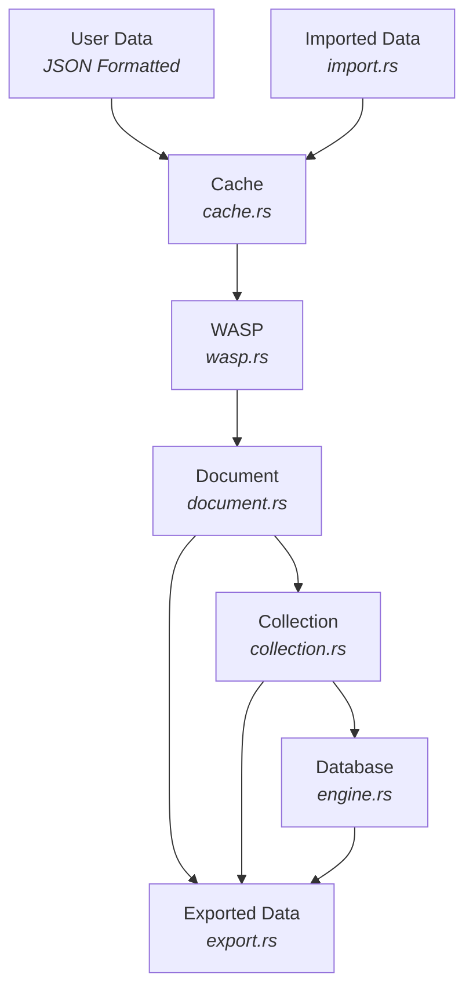

# NexusLite

NexusLite is an embedded NoSQL database engine inspired by MongoDB (document collections) and Redis (in-memory performance, TTL, LRU). It aims to be a lightweight, embeddable, efficient, and flexible database—akin to SQLite, but for NoSQL workloads. The default storage engine is WASP (Write-Ahead Shadow-Paging).

## Features

- Document collections with UUID-backed documents and rich metadata (timestamps, TTL)
- Hybrid cache with TTL-first and LRU eviction, metrics, and background sweeper
- Streaming import/export for NDJSON/CSV/BSON with auto-detect and error sidecar
- Pluggable storage backends: WASP (default) and WAL (for benchmarking)
- Crash consistency with checksums and atomic file operations (Windows-safe)
- Simple, thread-safe API with parking_lot::RwLock

### Quick start

Basic database operations using the default WASP-backed storage:

```rust
use bson::doc;
use nexus_lite::document::{Document, DocumentType};
use nexus_lite::Database;

fn main() -> Result<(), Box<dyn std::error::Error>> {
  // Open an existing database (creates mydb.wasp if missing). To create both files, use Database::new(Some("mydb.db")).
  let db = Database::open("mydb.db")?;

  // Create a collection and insert a document
  db.create_collection("users");
  let id = db.insert_document(
    "users",
    Document::new(doc!({"username": "alice", "age": 30}), DocumentType::Persistent),
  )?;

  // Read it back
  let users = db.get_collection("users").unwrap();
  println!("Found: {:?}", users.find_document(&id));
  Ok(())
}
```

Import/Export with the WASP engine directly:

```rust
use nexus_lite::engine::Engine;
use nexus_lite::import::{import_file, ImportOptions, ImportFormat};
use nexus_lite::export::{export_file, ExportOptions, ExportFormat};

fn main() -> Result<(), Box<dyn std::error::Error>> {
  let engine = Engine::with_wasp(std::path::PathBuf::from("mydb.wasp"))?;

  // Import NDJSON (auto-detect)
  let mut iopts = ImportOptions::default();
  iopts.collection = "users".into();
  iopts.format = ImportFormat::Auto;
  let _ = import_file(&engine, "data/users.jsonl", &iopts)?;

  // Export as CSV
  let mut eopts = ExportOptions::default();
  eopts.format = ExportFormat::Csv;
  let _ = export_file(&engine, "users", "export/users.csv", &eopts)?;
  Ok(())
}
```

## Logging

- Database-scoped logs are written automatically to a folder named after the DB stem, e.g., for mydb.db logs go to `mydb_logs/mydb.log`.
  You don’t need to call a global logger init; it’s handled during `Database::open`/`new`.

## WASP storage engine (default)

WASP (Write-Ahead Shadow-Paging) is a crash-consistent storage engine designed for embedded use:

- Copy-on-write page tree with checksums
- Double-buffered manifest with atomic pointer flips
- Tiny WAL integration for ordered durability
- Immutable segment store with bloom filters
- Background compaction and space reclamation
- Snapshot/MVCC-friendly read path

### Snapshot format and versioning

NexusLite writes a compact database snapshot into the `.db` file. The snapshot is a bincode-encoded structure wrapped with a small header:

- Magic: `NXL1` (ASCII)
- Version: `u32` (current: 1)
- Payload: `DbSnapshot` (operations optional, plus index descriptors)

Compatibility rules:

- The reader requires the magic/version header. Legacy raw `DbSnapshot` without the header is not supported in this initial development build.
- If a snapshot with a newer on-disk version is encountered, the reader returns an `Unsupported` error instead of panicking. Upgrade NexusLite to a compatible version or restore from a compatible snapshot.

Note: Index descriptors are also persisted in the snapshot. On startup/open, NexusLite ensures required indexes exist by rebuilding when needed.

### Handling snapshot decode errors (CLI)

If `nexuslite open-db` or other commands encounter a snapshot decode error, you’ll see one of the following:

- InvalidData (missing/invalid magic): the `.db` file is not a valid NexusLite snapshot for this build.
- Unsupported (newer version): the snapshot was written by a newer NexusLite; this build can’t read it.

Remediation:

- Ensure you’re using the same or newer NexusLite build that created the snapshot.
- If you only need the current state, re-run a checkpoint with a compatible build to regenerate the `.db` snapshot.
- If the `.db` snapshot is corrupted but the `.wasp` log is intact, you can remove/replace the `.db` and let a compatible build re-checkpoint from `.wasp`.

## Build and test

Using Cargo:

```powershell
cargo build
cargo test --all-features -- --nocapture
```

To enable optional regex support in queries, build with the feature flag:

```powershell
cargo test --features regex -- --nocapture
```

## CLI and REPL

The `nexuslite` binary offers admin and query commands plus an interactive shell.

Examples:

```powershell
# Info and doctor
nexuslite info
nexuslite doctor

# Create a document (persistent)
nexuslite create-document mycoll '{"user":"alice","age":31}'

# Create an ephemeral document with TTL from STDIN
echo '{"event":"login"}' | nexuslite create-document ignored --stdin --ephemeral --ttl 60

# List and purge ephemeral
nexuslite list-ephemeral
nexuslite purge-ephemeral --all

# Start REPL
nexuslite shell
# then type commands like:
#   help
#   list-collections
#   find mycoll {"age":{"$gte":30}}
#   count mycoll {"user":"alice"}
#   update mycoll {"user":"alice"} {"$set":{"age":32}}
#   delete mycoll {"user":"bob"}
#   create-document mycoll {"user":"carol"} ephemeral ttl=120
#   purge-ephemeral all
#   config
#   exit
```

### Telemetry and abuse resistance

You can tune observability and abuse resistance at runtime:

- Set slow query threshold (ms): `nexuslite telemetry-set-slow <ms>`
- Enable/disable audit logging: `nexuslite telemetry-set-audit <true|false>`
- Configure query log path and options: `nexuslite telemetry-set-query-log <path> [--slow-ms N] [--structured true|false]`
- Max results: global `nexuslite telemetry-set-max-global <N>`; per-collection `nexuslite telemetry-set-max-for <collection> <N>`
- Basic per-collection rate limiting (token bucket):
  - Configure: `nexuslite telemetry-rate-limit <collection> <capacity> <refill_per_sec>`
  - Remove: `nexuslite telemetry-rate-remove <collection>`

Programmatic API mirrors these via `nexus_lite::api::*` functions:

- `telemetry_set_db_name`, `telemetry_set_query_log`, `telemetry_set_audit_enabled`
- `telemetry_set_max_results_global`, `telemetry_set_max_results_for`
- `telemetry_configure_rate_limit`, `telemetry_remove_rate_limit`

### Encrypted open (PBE) and signature verification

If your `.db`/`.wasp` are password-based encrypted (PBE), NexusLite will decrypt on open.

- Interactive (TTY): prompts for username and a masked password

```powershell
# Prompts for Username and Password (masked) if DB is PBE-encrypted
nexuslite open-db .\\mydb.db
```

- Non-interactive (CI/scripts): provide credentials via environment variables

```powershell
$env:NEXUSLITE_USERNAME = 'alice'; $env:NEXUSLITE_PASSWORD = 's3cr3t'; nexuslite open-db .\\mydb.db
```

- Optional signature verification on open (default policy is config-driven; use --sig-warn to warn instead of fail)

```powershell
# Hard-fail on bad/missing signatures by default
nexuslite open-db .\\mydb.db --verify-sig --pubkey .\\pub.pem

# Warn-only
nexuslite open-db .\\mydb.db --verify-sig --pubkey .\\pub.pem --sig-warn
```

- Cache (TTL/LRU/LFU, metrics, sweeper): `tests/mod_cache.rs`
- Collections CRUD + index create/drop: `tests/mod_collection.rs`, `tests/mod_index.rs`
- Query (filters, projection, sort, pagination): `tests/mod_query.rs`
- Query extras: regex and timeout: `tests/mod_query_features.rs` (enable with `--features regex`)
- Import/Export NDJSON/CSV and options: `tests/mod_import.rs`
- Import/Export BSON roundtrip: `tests/mod_import.rs::test_import_bson_and_export_bson_roundtrip`
- WAL append/read: `tests/mod_wal.rs`
- WASP internals: CoW tree, segments, tiny WAL, checksum, torn-write: `tests/mod_wasp.rs`
- Snapshot/Checkpoint with index descriptors: `tests/mod_snapshot.rs`
- Paths, logging folders, DB/WASP files: `tests/mod_paths.rs`

Run core suite:

```powershell
cargo test -- --nocapture
```

Run with regex feature enabled for regex tests:

```powershell
cargo test --features regex -- --nocapture
```

## Database Architecture



---

## Project Structure

The following is the current project structure, subject to change:

```text
NexusLite
├── src\
│   ├── api.rs
│   ├── cache.rs
│   ├── cli.rs
│   ├── collection.rs
│   ├── crypto.rs
│   ├── document.rs
│   ├── engine.rs
│   ├── errors.rs
│   ├── export.rs
│   ├── import.rs
│   ├── index.rs
│   ├── lib.rs
│   ├── logger.rs
│   ├── query.rs
│   ├── types.rs
│   ├── wal.rs
│   └── wasp.rs
├── tests\
│   ├── common\
│   │   └── test_logger.rs
│   ├── integration.rs
│   ├── mod_api.rs
│   ├── mod_cache.rs
│   ├── mod_cli.rs
│   ├── mod_collection.rs
│   ├── mod_crypto.rs
│   ├── mod_document.rs
│   ├── mod_engine.rs
│   ├── mod_errors.rs
│   ├── mod_export.rs
│   ├── mod_import.rs
│   ├── mod_index.rs
│   ├── mod_lib.rs
│   ├── mod_paths.rs
│   ├── mod_query.rs
│   ├── mod_query_features.rs
│   ├── mod_snapshot.rs
│   ├── mod_types.rs
│   ├── mod_wal.rs
│   └── mod_wasp.rs
├── .gitignore
├── Cargo.lock
├── Cargo.toml
└── Project_Development.md
```

---

## Modules

### Document Module: document.rs

- Purpose: BSON-backed document with metadata, IDs, and TTL for ephemeral records.
- Features:
  - UUID v4 `DocumentId` assigned on creation
  - `DocumentType` (Persistent or Ephemeral)
  - Metadata: created_at, updated_at, optional TTL
  - `set_ttl`, `get_ttl`, `is_expired` helpers
  - `update` updates data and bumps `updated_at`

### Collection Module: collection.rs

- Purpose: Manage documents with a TTL-first + LRU cache and durable storage append.
- Features:
  - `new` and `new_with_config` to construct with cache capacity or config
  - `insert_document` writes to cache and appends Operation::Insert to storage
  - `find_document` reads from cache by ID
  - `update_document` upserts in cache and appends Operation::Update
  - `delete_document` evicts from cache and appends Operation::Delete
  - `get_all_documents` returns a snapshot Vec&lt;Document&gt; (clones; not streaming)
  - `cache_metrics` exposes cache metrics snapshot
  - Thread-safe via parking_lot::RwLock on storage

### Cache Module: cache.rs

- Purpose: In-memory cache with TTL-first plus LRU eviction to keep hot data fast.
- Features:
  - TTL expiration takes priority; lazy expiration on access
  - LRU sampling with configurable max_samples when no TTLs are expired
  - Eviction batching and guard to prevent thundering evictions
  - Background sweeper with configurable interval
  - Per-collection cache configuration and runtime tuning
  - Metrics: hits/misses, eviction counts, memory/latency stats

### WAL Module: wal.rs

- Purpose: Append-only write-ahead log to ensure durability and enable recovery.
- Features:
  - Append operations before commit for crash consistency
  - Read/replay log records on startup to rebuild state
  - Lightweight record format with basic integrity checks
  - Used as an alternative pluggable backend for benchmarking

### WASP Module: wasp.rs

- Purpose: Default persistence engine using Write-Ahead Shadow-Paging (WASP).
- Features:
  - Copy-on-write page tree with checksums
  - Manifest with atomic pointer flip (double-buffered)
  - Tiny WAL integration for commit ordering
  - Immutable segment store with bloom filters
  - Background compaction and space reclaim (GC)
  - Snapshot/MVCC-friendly read path

### Types Module: types.rs

- Purpose: Shared core types for IDs, operations, and metadata.
- Features:
  - Strongly-typed DocumentId (UUID v4)
  - Operation enums for insert/update/delete
  - Reusable structs/enums for cache and storage coordination

### Errors Module: errors.rs

- Purpose: Centralized error definitions with rich context.
- Features:
  - thiserror-based DbError for ergonomic error handling
  - Variants for IO, serialization, and domain errors (e.g., NoSuchCollection)
  - Consistent messages surfaced across modules and CLI

### Engine Module: engine.rs

- Purpose: Orchestrates collections and persistence backends.
- Features:
  - Create/get/delete collections; list collection names
  - Pluggable storage: WAL or WASP (default via Engine::with_wasp)
  - Hidden `_tempDocuments` collection for ephemeral docs
  - On startup, loads ephemeral docs into cache when applicable
  - Thread-safe via parking_lot::RwLock

### Logger Module: logger.rs

- Purpose: Initialize structured logging for the system.
- Features:
  - log/log4rs setup via `logger::init()`
  - Configurable levels and appenders through `log4rs.yaml`

### Import Module: import.rs

- Purpose: Streaming data ingestion for CSV, NDJSON (JSON Lines), and BSON.
- Features:
  - Auto-detect format with explicit override
  - Per-format options: CSV (delimiter, headers, type inference), JSON (array_mode)
  - skip_errors with sidecar `.errors.jsonl` capturing failures
  - TTL mapping via `ttl_field` for ephemeral documents; persistent toggle
  - Progress logging and basic batching controls

### Export Module: export.rs

- Purpose: Streaming export of collections to CSV, NDJSON, or BSON.
- Features:
  - CSV with optional headers and custom delimiter
  - NDJSON line-by-line output for large files
  - BSON length-prefixed streaming writer
  - Writes to temp file then atomically replaces destination (Windows-safe)
  - Returns ExportReport with written counts

### API Module: api.rs

- Purpose: Provides a Rust API abstraction for embedding into apps.
- Features:
  - Convenience helpers around core engine operations
  - Find/Count and Updates/Deletes: `find`, `count`, `update_many`, `update_one`, `delete_many`, `delete_one`
  - JSON helpers: `parse_filter_json`, `parse_update_json`
  - Import/Export helpers: `import`, `export`
  - Database/Collections management (FFI-friendly): `db_open`, `db_create_collection`, `db_list_collections`, `db_delete_collection`, `db_rename_collection`
  - Stable surface for embedding while internals evolve

### CLI Module: cli.rs

- Purpose: Provides CLI support for developers and DB administration.
- Features:
  - Import/Export commands
  - Collection management: `ColCreate`, `ColDelete`, `ColList`, `ColRename`
  - Query commands: `QueryFind`, `QueryCount`, `QueryUpdate`, `QueryDelete`, plus single-doc `QueryUpdateOne`, `QueryDeleteOne`
  - Programmatic entrypoint `cli::run(engine, cmd)` returning reports

  ### Query Module: query.rs

  - Purpose: Typed, injection-safe query and update engine.
  - Features:
    - Filter DSL: $eq/$gt/$gte/$lt/$lte, $in/$nin, $exists, $and/$or/$not
    - Optional $regex (feature flag "regex") with pattern-length guard
    - Projection, multi-key stable sort, pagination (limit/skip)
  - Update ops: $set, $inc, $unset; UpdateReport/DeleteReport; single-ops `update_one`, `delete_one`
    - FindOptions has optional timeout_ms for best-effort cancellation

### Database Module: lib.rs

- Purpose: User-facing database wrapper around Engine with ergonomic helpers.
- Features:
  - `Database::new(name_or_path: Option<&str>)` to create the DB (and `.wasp`) if missing
  - `Database::open(name_or_path: Option<&str>)` to open an existing DB (errors `Database Not Found` if missing)
  - `Database::close(name_or_path: Option<&str>)` to close/unregister an open DB handle
  - Collection management: create/get/delete, list names, `rename_collection`
  - Document helpers: insert/update/delete
  - `nexus_lite::init()` to initialize logging

---

## Example Usage (Sprint 1)

```rust
use bson::doc;
use nexus_lite::document::{Document, DocumentType};
use nexus_lite::Database;

fn main() -> Result<(), Box<dyn std::error::Error>> {
  // Initialize logging, etc.
  nexus_lite::init()?;

  // Create or open database (WASP-backed by default)
  // Use default name (nexuslite.db / nexuslite.wasp)
  let db = Database::new(None)?;

  // Create a collection
  db.create_collection("users");

  // Optionally rename a collection (admin)
  db.rename_collection("users", "people")?;

  // Insert a document
  let user_doc = Document::new(doc!({"username": "alice", "age": 30}), DocumentType::Persistent);
  let doc_id = db.insert_document("people", user_doc)?;

  // Query document
  let users = db.get_collection("people").unwrap();
  let found = users.find_document(&doc_id).unwrap();
  println!("Found: {:?}", found);

  // Update document
  let updated = Document::new(doc!({"username": "alice", "age": 31}), DocumentType::Persistent);
  db.update_document("people", &doc_id, updated)?;

  // Delete document
  db.delete_document("people", &doc_id)?;
  Ok(())
}
```

---

## Example Usage for Import & Export

Programmatic API usage for importing and exporting collections.

```rust
use nexus_lite::engine::Engine;
use nexus_lite::import::{import_file, ImportOptions, ImportFormat};
use nexus_lite::export::{export_file, ExportOptions, ExportFormat};

fn main() -> Result<(), Box<dyn std::error::Error>> {
  // Open or create a WASP-backed engine file
  let engine = Engine::with_wasp(std::path::PathBuf::from("nexus.wasp"))?;

  // Import NDJSON (auto-detect also works based on extension)
  let mut iopts = ImportOptions::default();
  iopts.collection = "users".into();
  iopts.format = ImportFormat::Auto; // or: Csv, Ndjson, Bson
  // CSV example: iopts.format = ImportFormat::Csv; iopts.csv.has_headers = true; iopts.csv.delimiter = b',';
  let _irep = import_file(&engine, "data/users.jsonl", &iopts)?;

  // Export as NDJSON
  let mut eopts = ExportOptions::default();
  eopts.format = ExportFormat::Ndjson; // or: Csv, Bson
  let _erep = export_file(&engine, "users", "export/users.jsonl", &eopts)?;
  Ok(())
}
```

Notes

- skip_errors + error sidecar: set `iopts.skip_errors = true` and `iopts.error_sidecar = Some("errors.jsonl".into())` to log bad rows.
- Pandas: `pd.read_json('export/users.jsonl', lines=True)` reads NDJSON efficiently.

---

## Query & Update examples

Programmatic query API with typed filters and updates.

```rust
use bson::{doc, Bson};
use nexus_lite::document::{Document, DocumentType};
use nexus_lite::query::{Filter, CmpOp, FindOptions, SortSpec, Order, UpdateDoc};
use nexus_lite::Database;

fn main() -> Result<(), Box<dyn std::error::Error>> {
  let db = Database::open("mydb.db")?;
  db.create_collection("users");
  db.insert_document("users", Document::new(doc!({"name": "alice", "age": 30}), DocumentType::Persistent))?;
  db.insert_document("users", Document::new(doc!({"name": "bob", "age": 40}), DocumentType::Persistent))?;

  // Find: age > 30, project name only, sort by age desc, limit 1
  let filter = Filter::Cmp { path: "age".into(), op: CmpOp::Gt, value: Bson::from(30) };
  let opts = FindOptions {
    projection: Some(vec!["name".into()]),
    sort: Some(vec![SortSpec { field: "age".into(), order: Order::Desc }]),
    limit: Some(1),
    skip: Some(0),
    timeout_ms: Some(250), // optional best-effort timeout
  };
  let docs = db.find("users", &filter, &opts)?.to_vec();
  assert_eq!(docs.len(), 1);

  // Count
  let count = db.count("users", &filter)?;
  assert_eq!(count, 1);

  // Update: $inc age by 1 for all with age >= 30
  let upd_filter = Filter::Cmp { path: "age".into(), op: CmpOp::Gte, value: Bson::from(30) };
  let upd = UpdateDoc { set: vec![], inc: vec![("age".into(), 1.0)], unset: vec![] };
  let report = db.update_many("users", &upd_filter, &upd)?;
  println!("matched={} modified={}", report.matched, report.modified);

  // Delete: remove users named carol
  let del_filter = Filter::Cmp { path: "name".into(), op: CmpOp::Eq, value: Bson::from("carol") };
  let del = db.delete_many("users", &del_filter)?;
  println!("deleted={}", del.deleted);
  Ok(())
}
```

### Export redaction

Mask sensitive fields while exporting:

```powershell
nexuslite export mycoll out.ndjson --redact password,token,ssn
```

### Cryptography commands

Key generation, sign/verify, and file encryption/decryption are available:

```powershell
# Generate a P-256 keypair (PEM files)
nexuslite crypto-keygen --out-priv priv.pem --out-pub pub.pem

# Sign and verify
nexuslite crypto-sign priv.pem input.bin --out-sig sig.der
nexuslite crypto-verify pub.pem input.bin sig.der

# Encrypt/decrypt files (ECDH P-256 + AES-256-GCM)
nexuslite crypto-encrypt pub.pem input.db output.enc
nexuslite crypto-decrypt priv.pem output.enc output.dec

# Encrypted DB checkpoint and restore
nexuslite checkpoint-encrypted mydb.db pub.pem mydb.enc
nexuslite restore-encrypted mydb.db priv.pem mydb.enc
```

JSON parsing helpers

```rust
use nexus_lite::query::{parse_filter_json, parse_update_json};

let f = parse_filter_json(r#"{"age": {"$gt": 21}}"#)?; // Filter
let u = parse_update_json(r#"{"$set":{"active":true}, "$inc":{"logins":1}}"#)?; // UpdateDoc
```

Notes

- $regex is behind the Cargo feature flag "regex". When enabled, only safe-length patterns (<= 512 chars) are accepted.
- FindOptions::timeout_ms cancels long scans on a best-effort basis.
- Logs are written to `{db_name}_logs/{db_name}.log` when opening a database.
- Projection semantics: when `FindOptions.projection` is set, returned documents contain only the requested fields (sorting is applied before projection).

## Future Enhancements

- Add support for PQC encryption/decryption and signature verification of the database.
  - Use `pqcrypto-mlkem` for key encapsulation (`ml-kem-512`, `ml-kem-768`, `ml-kem-1024`).
  - Use `pqcrypto-sphincsplus` for signature verification (`128`, `192`, `256`-bit hash functions).
  - Provide Cargo feature flags to toggle encryption support.
  - Encrypt snapshots, WAL, and per-collection files.
  - Sign persisted data to ensure integrity.
- Add Vector Map Indexing for searching through collections and documents

## Post-Quantum Cryptography (PQC) roadmap and alignment

NexusLite uses modern ECC (P-256) today for file encryption (via ECDH+HKDF→AES-256-GCM) and ECDSA for signatures. To prepare for PQC:

- Target KEMs: ML-KEM (Kyber) families for hybrid key exchange. Plan: a hybrid ECDH(P-256)+ML-KEM shared secret, HKDF to AES-256-GCM keys.
- Target signatures: SPHINCS+ for long-lived artifact signatures, with optional Ed25519/P-256 fallback during transition.
- Feature flags: `crypto-pqc` to opt-in; hybrid mode default when enabled. Pure-PQC mode is an experimental build.
- Artifacts in scope: encrypted checkpoints, `.db`/`.wasp` at-rest encryption, and `.db.sig`/`.wasp.sig` alongside.
- Validation: interop tests using `pqcrypto-mlkem` and `pqcrypto-sphincsplus` vectors; round-trips and tamper tests.
- Timeline: stage 1 (API stubs and feature-flagged builds), stage 2 (hybrid encryption for checkpoints), stage 3 (optional at-rest PQC), stage 4 (PQC signatures for release artifacts).

Security posture alignment

- Hard-fail vs warn policy for signature checks is configurable (`open-db --verify-sig [--sig-warn]`).
- PBE flow: on open, if `.db`/`.wasp` are PBE-wrapped, NexusLite requires `NEXUSLITE_USERNAME` and `NEXUSLITE_PASSWORD` to decrypt before opening.
- Config secrets hygiene: doctor/info avoid printing credential-like values; prefer environment variables.
