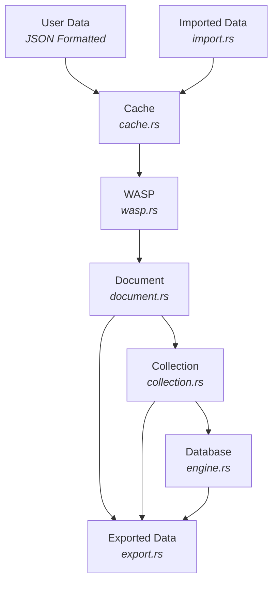

# Nexus Lite - Project Development Roadmap

Nexus-Lite is an embedded **NoSQL database engine**, inspired by the best features of **MongoDB** (document collections) and **Redis** (in-memory performance, TTL, and LRU caching). The goal is to provide a **lightweight, embeddable, efficient, and flexible** database engine similar to SQLite but for NoSQL workloads.

---

[Watch NotebookLM's Overview on Youtube](https://www.youtube.com/watch?v=6RnNEfNk_G4)

---

## AGILE Project Roadmap

We’ll follow an **iterative AGILE approach** where each sprint adds working, testable functionality.  
Future features will always build on stable, well-tested foundations.

**Notes:**

- Design with concurrency in mind using `RwLock` from the start as well as handling and logging errors.
- Design with async in mind using `tokio` for both network and file-based async I/O.

### Sprint 1 - Core In-Memory Engine

- [x] Developer Documentation (Project_Development.md).
- [x] Implement error handling and logging using `log` and `log4rs`.
- [x] Implement `Document` module (`document.rs`)
  - Create, find, update, delete BSON-like documents.
  - Assign UUID v4 on creation; store document metadata (timestamps, TTL for ephemeral docs).
- [x] Implement `Collection` module (`collection.rs`)
  - Manage sets of documents inside named collections (with `_tempDocuments` hidden collection).
  - Maintain an index of document UUIDs.
- [x] Implement `Engine` module (`engine.rs`)
  - Manage multiple collections; file-backed via pluggable storage.
- [x] Implement Rust API calls to database engine (`lib.rs`).
- [x] Add unit & integration testing framework (`tests/` + `common/test_logger.rs`).
- [x] Generate Rust documentation (RustDoc) using `cargo doc`.
- [x] Perform tests and then troubleshoot and fix any issues.
- [x] Update Developer Documentation (Project_Development.md).

### Sprint 2 - Cache Layer (Redis-inspired)

- [x] Implement Hybrid TTL-first + LRU eviction policy with runtime tuning.
- [x] Metrics (hits/misses, eviction counts, memory/latency stats).
- [x] Background sweeper and lazy expiration on access.
- [x] Deterministic purge trigger for tests.
- [x] Tests and documentation updates.

### Sprint 3 - Persistence

- [x] Implement WASP (Write-Ahead Shadow-Paging) storage engine and make it default.
- [x] Pluggable storage: WAL vs WASP for benchmarking.
- [x] Tiny WAL layer + recovery; manifest pointer flip; CoW pages.
- [x] Immutable segments with bloom filters; compaction & GC.
- [x] Concurrency & MVCC snapshot basics; checksums; torn-write protection.
- [x] Benchmarks and tests; docs updated.

### Sprint 4 - Import & Export Features

- [x] Import CSV/NDJSON/BSON with auto-detect, streaming, TTL mapping.
- [x] Export CSV/NDJSON/BSON with Windows-safe atomic replace.
- [x] CLI (programmatic) for import/export; tests.
- [x] Documentation refresh (README examples, pandas notes).

### Sprint 5 - Querying & APIs

- [ ] Query engine (`find_documents_by_field`, operators `$gt`, `$lt`, `$in`, etc.).
- [ ] Update operators (`$set`, `$inc`, `$unset`).
- [ ] Create REST/gRPC API for external usage.
- [ ] Developer-friendly Rust API bindings.
- [ ] Perform tests and then troubleshoot and fix any issues.
- [ ] Update Developer Documentation (Project_Development.md).

### Sprint 6 - Optimization, Extensions, Additional Features

- [ ] Indexing strategies.
- [ ] Transaction support.
- [ ] Deployment tooling (CLI & embedded support).
- [ ] Implement Key/Pair based encryption and decryption using ECC-256 bit encryption.
- [ ] Implement signature verification using ECDSA.
- [ ] Perform tests and then troubleshoot and fix any issues.
- [ ] Update Developer Documentation (Project_Development.md).

---

## Database Architecture



---

## Project Structure

The following is the current project structure, subject to change:

```text
nexus_lite
├── src\
│   ├── api.rs
│   ├── cache.rs
│   ├── cli.rs
│   ├── collection.rs
│   ├── crypto.rs
│   ├── document.rs
│   ├── engine.rs
│   ├── errors.rs
│   ├── export.rs
│   ├── import.rs
│   ├── lib.rs
│   ├── logger.rs
│   ├── types.rs
│   └── wal.rs
├── tests\
│   ├── common\
│   │   └── test_logger.rs
│   ├── integration.rs
│   ├── mod_api.rs
│   ├── mod_cli.rs
│   ├── mod_collection.rs
│   ├── mod_crypto.rs
│   ├── mod_document.rs
│   ├── mod_engine.rs
│   ├── mod_errors.rs
│   ├── mod_export.rs
│   ├── mod_import.rs
│   ├── mod_lib.rs
│   ├── mod_logger.rs
│   ├── mod_types.rs
│   └── mod_wal.rs
├── .gitignore
├── Cargo.lock
├── Cargo.toml
└── Project_Development.md
```

---

## Modules

### Document Module: document.rs

- Purpose: BSON-backed document with metadata, IDs, and TTL for ephemeral records.
- Features:
  - UUID v4 `DocumentId` assigned on creation
  - `DocumentType` (Persistent or Ephemeral)
  - Metadata: created_at, updated_at, optional TTL
  - `set_ttl`, `get_ttl`, `is_expired` helpers
  - `update` updates data and bumps `updated_at`

### Collection Module: collection.rs

- Purpose: Manage documents with a TTL-first + LRU cache and durable storage append.
- Features:
  - `new` and `new_with_config` to construct with cache capacity or config
  - `insert_document` writes to cache and appends Operation::Insert to storage
  - `find_document` reads from cache by ID
  - `update_document` upserts in cache and appends Operation::Update
  - `delete_document` evicts from cache and appends Operation::Delete
  - `get_all_documents` returns a snapshot Vec&lt;Document&gt; (clones; not streaming)
  - `cache_metrics` exposes cache metrics snapshot
  - Thread-safe via parking_lot::RwLock on storage

### Cache Module: cache.rs

- Purpose: In-memory cache with TTL-first plus LRU eviction to keep hot data fast.
- Features:
  - TTL expiration takes priority; lazy expiration on access
  - LRU sampling with configurable max_samples when no TTLs are expired
  - Eviction batching and guard to prevent thundering evictions
  - Background sweeper with configurable interval
  - Per-collection cache configuration and runtime tuning
  - Metrics: hits/misses, eviction counts, memory/latency stats

### WAL Module: wal.rs

- Purpose: Append-only write-ahead log to ensure durability and enable recovery.
- Features:
  - Append operations before commit for crash consistency
  - Read/replay log records on startup to rebuild state
  - Lightweight record format with basic integrity checks
  - Used as an alternative pluggable backend for benchmarking

### WASP Module: wasp.rs

- Purpose: Default persistence engine using Write-Ahead Shadow-Paging (WASP).
- Features:
  - Copy-on-write page tree with checksums
  - Manifest with atomic pointer flip (double-buffered)
  - Tiny WAL integration for commit ordering
  - Immutable segment store with bloom filters
  - Background compaction and space reclaim (GC)
  - Snapshot/MVCC-friendly read path

### Types Module: types.rs

- Purpose: Shared core types for IDs, operations, and metadata.
- Features:
  - Strongly-typed DocumentId (UUID v4)
  - Operation enums for insert/update/delete
  - Reusable structs/enums for cache and storage coordination

### Errors Module: errors.rs

- Purpose: Centralized error definitions with rich context.
- Features:
  - thiserror-based DbError for ergonomic error handling
  - Variants for IO, serialization, and domain errors (e.g., NoSuchCollection)
  - Consistent messages surfaced across modules and CLI

### Engine Module: engine.rs

- Purpose: Orchestrates collections and persistence backends.
- Features:
  - Create/get/delete collections; list collection names
  - Pluggable storage: WAL or WASP (default via Engine::with_wasp)
  - Hidden `_tempDocuments` collection for ephemeral docs
  - On startup, loads ephemeral docs into cache when applicable
  - Thread-safe via parking_lot::RwLock

### Logger Module: logger.rs

- Purpose: Initialize structured logging for the system.
- Features:
  - log/log4rs setup via `logger::init()`
  - Configurable levels and appenders through `log4rs.yaml`

### Import Module: import.rs

- Purpose: Streaming data ingestion for CSV, NDJSON (JSON Lines), and BSON.
- Features:
  - Auto-detect format with explicit override
  - Per-format options: CSV (delimiter, headers, type inference), JSON (array_mode)
  - skip_errors with sidecar `.errors.jsonl` capturing failures
  - TTL mapping via `ttl_field` for ephemeral documents; persistent toggle
  - Progress logging and basic batching controls

### Export Module: export.rs

- Purpose: Streaming export of collections to CSV, NDJSON, or BSON.
- Features:
  - CSV with optional headers and custom delimiter
  - NDJSON line-by-line output for large files
  - BSON length-prefixed streaming writer
  - Writes to temp file then atomically replaces destination (Windows-safe)
  - Returns ExportReport with written counts

### API Module: api.rs

- Purpose: Provides a Rust API abstraction for embedding into apps.
- Features:
  - Convenience helpers around core engine operations
  - Stable surface for embedding while internals evolve

### CLI Module: cli.rs

- Purpose: Provides CLI support for developers.
- Features:
  - Command enum with Import/Export operations
  - Simple format parsers and option mapping
  - Programmatic entrypoint `cli::run(engine, cmd)` returning reports

### Database Module: lib.rs

- Purpose: User-facing database wrapper around Engine with ergonomic helpers.
- Features:
  - `Database::new()` and `Database::open(path)` for setup
  - Collection management: create/get/delete, list names
  - Document helpers: insert/update/delete
  - `nexus_lite::init()` to initialize logging

---

## Example Usage (Sprint 1)

```rust
use bson::doc;
use nexus_lite::document::{Document, DocumentType};
use nexus_lite::Database;

fn main() -> Result<(), Box<dyn std::error::Error>> {
  // Initialize logging, etc.
  nexus_lite::init()?;

  // Create or open database (WASP-backed by default)
  let db = Database::new()?;

  // Create a collection
  db.create_collection("users");

  // Insert a document
  let user_doc = Document::new(doc!({"username": "alice", "age": 30}), DocumentType::Persistent);
  let doc_id = db.insert_document("users", user_doc)?;

  // Query document
  let users = db.get_collection("users").unwrap();
  let found = users.find_document(&doc_id).unwrap();
  println!("Found: {:?}", found);

  // Update document
  let updated = Document::new(doc!({"username": "alice", "age": 31}), DocumentType::Persistent);
  db.update_document("users", &doc_id, updated)?;

  // Delete document
  db.delete_document("users", &doc_id)?;
  Ok(())
}
```

---

## Example Usage for Import & Export

Programmatic API usage for importing and exporting collections.

```rust
use nexus_lite::engine::Engine;
use nexus_lite::import::{import_file, ImportOptions, ImportFormat};
use nexus_lite::export::{export_file, ExportOptions, ExportFormat};

fn main() -> Result<(), Box<dyn std::error::Error>> {
  // Open or create a WASP-backed engine file
  let engine = Engine::with_wasp(std::path::PathBuf::from("nexus.wasp"))?;

  // Import NDJSON (auto-detect also works based on extension)
  let mut iopts = ImportOptions::default();
  iopts.collection = "users".into();
  iopts.format = ImportFormat::Auto; // or: Csv, Ndjson, Bson
  // CSV example: iopts.format = ImportFormat::Csv; iopts.csv.has_headers = true; iopts.csv.delimiter = b',';
  let _irep = import_file(&engine, "data/users.jsonl", &iopts)?;

  // Export as NDJSON
  let mut eopts = ExportOptions::default();
  eopts.format = ExportFormat::Ndjson; // or: Csv, Bson
  let _erep = export_file(&engine, "users", "export/users.jsonl", &eopts)?;
  Ok(())
}
```

Notes

- skip_errors + error sidecar: set `iopts.skip_errors = true` and `iopts.error_sidecar = Some("errors.jsonl".into())` to log bad rows.
- Pandas: `pd.read_json('export/users.jsonl', lines=True)` reads NDJSON efficiently.

---

## Future Enhancements

- Add support for PQC encryption/decryption and signature verification of the database.
  - Use `pqcrypto-mlkem` for key encapsulation (`ml-kem-512`, `ml-kem-768`, `ml-kem-1024`).
  - Use `pqcrypto-sphincsplus` for signature verification (`128`, `192`, `256`-bit hash functions).
  - Provide Cargo feature flags to toggle encryption support.
  - Encrypt snapshots, WAL, and per-collection files.
  - Sign persisted data to ensure integrity.
- Add Vector Map Indexing for searching through collections and documents
